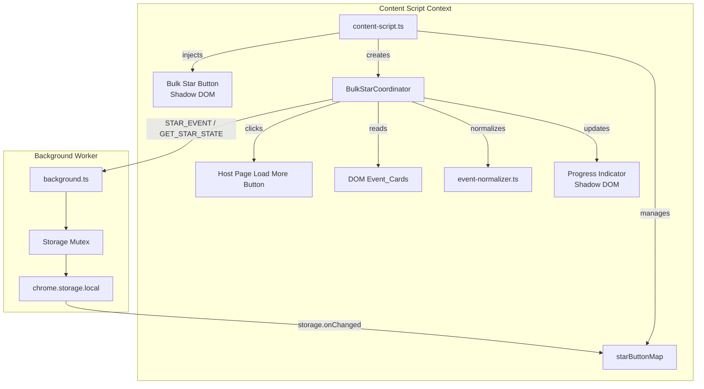
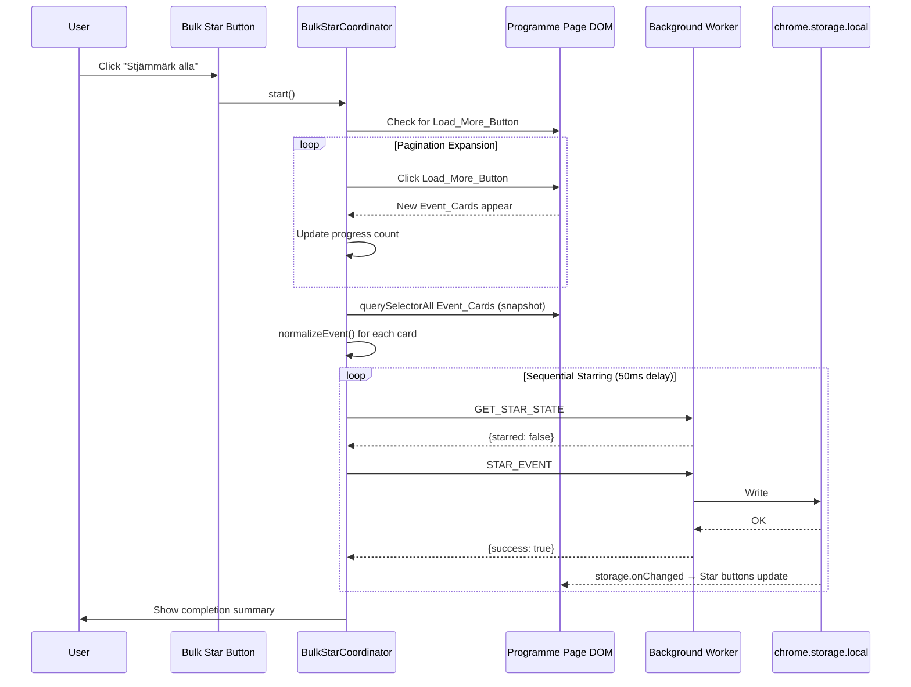

# Design Document: Bulk Star Filtered

## Overview

This feature adds a "Bulk Star All" button to the Almedalsveckan programme page that stars all currently visible/filtered events in a single operation. The system programmatically expands pagination (clicking "Visa fler" repeatedly), collects all loaded Event_Cards, normalizes them, and sends sequential STAR_EVENT messages to the background worker.

The design follows existing patterns: Shadow DOM for style isolation, `IBrowserApiAdapter` for all browser API access, message passing to the background worker for storage, and the existing `MutationObserver` + `starButtonMap` for UI synchronization.

### Key Design Decisions

1. **New module (`bulk-star-coordinator.ts`)** rather than extending `content-script.ts` — keeps the content script focused on card injection and the coordinator focused on orchestration.
2. **Sequential message passing with rate limiting** — respects the existing storage mutex in the background worker, avoids overwhelming it.
3. **Snapshot-based collection** — events are collected once after pagination completes; DOM changes during starring are ignored for consistency.
4. **Cancellation via AbortController** — clean, standard mechanism for both pagination and starring phases.
5. **No new message commands** — reuses existing `STAR_EVENT` and `GET_STAR_STATE` commands.

## Architecture



### Flow Sequence



## Components and Interfaces

### 1. BulkStarCoordinator (`src/extension/bulk-star-coordinator.ts`)

The core orchestration module. Stateless between operations — all state is local to a single bulk operation execution.

```typescript
export interface BulkStarOptions {
  readonly adapter: IBrowserApiAdapter;
  readonly onProgress: (state: BulkStarProgress) => void;
  readonly signal: AbortSignal;
  readonly locale: SupportedLocale;
}

export interface BulkStarProgress {
  readonly phase: 'loading' | 'starring' | 'complete' | 'cancelled' | 'error';
  readonly eventsLoaded: number;
  readonly eventsProcessed: number;
  readonly eventsTotal: number;
  readonly eventsNewlyStarred: number;
  readonly eventsAlreadyStarred: number;
  readonly eventsFailed: number;
  readonly eventsSkipped: number;
}

export interface BulkStarResult {
  readonly eventsFound: number;
  readonly eventsNewlyStarred: number;
  readonly eventsAlreadyStarred: number;
  readonly eventsFailed: number;
  readonly eventsSkipped: number;
  readonly aborted: boolean;
  readonly abortReason: 'user-cancel' | 'error-threshold' | null;
}

/** Executes the full bulk-star workflow. */
export async function executeBulkStar(options: BulkStarOptions): Promise<BulkStarResult>;
```

### 2. PaginationExpander (internal to coordinator)

```typescript
interface PaginationExpanderOptions {
  readonly signal: AbortSignal;
  readonly onBatchLoaded: (count: number) => void;
  readonly maxClicks: number;         // 100
  readonly clickTimeout: number;      // 10_000ms
  readonly clickDelay: number;        // 300ms
}

/** Expands all pagination pages by clicking Load_More_Button. */
async function expandPagination(options: PaginationExpanderOptions): Promise<number>;
```

### 3. BulkStarButton (`src/extension/bulk-star-button.ts`)

Shadow DOM isolated button, similar to `star-button.ts` but renders as a rectangular text button.

```typescript
export interface BulkStarButtonOptions {
  readonly locale: SupportedLocale;
  readonly onActivate: () => void;
}

export interface BulkStarButtonHandle {
  readonly setDisabled: (disabled: boolean) => void;
  readonly setVisible: (visible: boolean) => void;
  readonly destroy: () => void;
}

export function createBulkStarButton(
  hostElement: Element,
  options: BulkStarButtonOptions,
): BulkStarButtonHandle;
```

### 4. ProgressIndicator (`src/extension/progress-indicator.ts`)

Shadow DOM isolated progress display with cancel button and aria-live region.

```typescript
export interface ProgressIndicatorOptions {
  readonly locale: SupportedLocale;
  readonly onCancel: () => void;
}

export interface ProgressIndicatorHandle {
  readonly update: (progress: BulkStarProgress) => void;
  readonly dismiss: () => void;
  readonly destroy: () => void;
}

export function createProgressIndicator(
  hostElement: Element,
  options: ProgressIndicatorOptions,
): ProgressIndicatorHandle;
```

### 5. Content Script Integration

The existing `content-script.ts` is extended minimally:
- On initialization, inject the Bulk Star Button (after initial DOM scan).
- Expose `starButtonMap` and `findEventCards` for coordinator usage (already exported).
- The coordinator is imported and triggered on button click.

### 6. Locale Messages (additions to `_locales/`)

New message keys added to both `sv/messages.json` and `en/messages.json`:

| Key | sv | en |
|-----|----|----|
| `bulkStarAll` | Stjärnmärk alla | Star all |
| `bulkStarLoading` | Laddar evenemang... | Loading events... |
| `bulkStarEventsFound` | $1 evenemang hittade | $1 events found |
| `bulkStarProgress` | $1 / $2 | $1 / $2 |
| `bulkStarCancel` | Avbryt | Cancel |
| `bulkStarComplete` | $1 nya, $2 redan stjärnmärkta | $1 new, $2 already starred |
| `bulkStarCancelled` | Avbrutet: $1 stjärnmärkta av $2 | Cancelled: $1 starred of $2 |
| `bulkStarError` | Något gick fel. Försök igen. | Something went wrong. Try again. |

## Data Models

### BulkStarProgress (runtime state)

```typescript
interface BulkStarProgress {
  readonly phase: 'loading' | 'starring' | 'complete' | 'cancelled' | 'error';
  readonly eventsLoaded: number;       // Events found during pagination
  readonly eventsProcessed: number;    // Events processed so far in starring phase
  readonly eventsTotal: number;        // Total events to process
  readonly eventsNewlyStarred: number; // Successfully starred (new)
  readonly eventsAlreadyStarred: number; // Skipped (already starred)
  readonly eventsFailed: number;       // Failed after retry
  readonly eventsSkipped: number;      // Normalization failures
}
```

### No new storage schema additions

The feature reuses the existing `starredEvents` storage key and `StarredEvent` type. No new persistent data is introduced.

### Constants

```typescript
const BULK_STAR_CONSTANTS = {
  MAX_EVENTS_PER_BATCH: 2000,
  MAX_PAGINATION_CLICKS: 100,
  PAGINATION_CLICK_TIMEOUT_MS: 10_000,
  PAGINATION_CLICK_DELAY_MS: 300,
  STAR_MESSAGE_DELAY_MS: 50,
  BATCH_SIZE: 50,
  BATCH_THRESHOLD: 200,
  RETRY_DELAY_MS: 1000,
  MAX_RETRIES: 1,
  ERROR_ABORT_THRESHOLD: 0.5,
  SUMMARY_DISPLAY_MS: 5000,
  BUTTON_VIEWPORT_OFFSET_PX: 16,
} as const;
```


## Correctness Properties

*A property is a characteristic or behavior that should hold true across all valid executions of a system — essentially, a formal statement about what the system should do. Properties serve as the bridge between human-readable specifications and machine-verifiable correctness guarantees.*

### Property 1: Bulk button visibility tracks Event_Card presence

*For any* Programme_Page DOM state with N Event_Cards (where N ≥ 0), the Bulk_Star_Button SHALL be visible if and only if N > 0.

**Validates: Requirements 1.4, 1.6**

### Property 2: Collection yields only valid normalized events

*For any* set of `li` elements in the DOM where some contain `.event-information` and some do not, and where some normalizable cards produce `ok: true` and some produce `ok: false`, the collected event set SHALL contain exactly those events where the element is a valid Event_Card AND normalization succeeds.

**Validates: Requirements 3.1, 3.2, 7.1**

### Property 3: Only unstarred events receive STAR_EVENT messages

*For any* set of normalized events where each has a known starred state (starred or unstarred), the coordinator SHALL send STAR_EVENT messages only for events whose GET_STAR_STATE response indicates `starred: false`. Events already starred SHALL be counted as `alreadyStarred` and not sent to storage.

**Validates: Requirements 3.3, 3.4**

### Property 4: Maximum 2000 events processed per batch

*For any* DOM containing N Event_Cards (where N may exceed 2000), the coordinator SHALL process at most `min(N, 2000)` events, taking the first 2000 in DOM order.

**Validates: Requirements 3.8**

### Property 5: Snapshot isolation — DOM mutations during starring do not affect the processed set

*For any* bulk operation that has collected a snapshot of K events after pagination, if the DOM is mutated (cards added or removed) during the starring phase, the coordinator SHALL continue processing exactly the K events from the original snapshot without re-scanning.

**Validates: Requirements 5.1, 5.2, 5.4**

### Property 6: Retry logic — failed events get exactly one retry

*For any* event where the initial STAR_EVENT message returns `success: false` or throws, the coordinator SHALL retry exactly once after 1000ms. If the retry also fails, the event SHALL be counted as failed and skipped.

**Validates: Requirements 7.2**

### Property 7: Abort threshold — operation aborts when failure rate exceeds 50%

*For any* bulk operation where the ratio of failed events (after retry) to total events attempted exceeds 0.5, the coordinator SHALL abort the operation and report an error state. When the ratio is ≤ 0.5, the operation SHALL continue to completion.

**Validates: Requirements 7.3**

### Property 8: No unhandled exceptions propagate from coordinator

*For any* combination of errors during a bulk operation (adapter.sendMessage throws, DOM queries return unexpected results, normalization throws), the coordinator SHALL catch all exceptions internally and never propagate an unhandled rejection or throw.

**Validates: Requirements 7.5**

### Property 9: Sequential rate limiting — minimum 50ms between STAR_EVENT messages

*For any* batch of events being starred, the time between consecutive STAR_EVENT message sends SHALL be ≥ 50ms. No two messages SHALL be in-flight simultaneously.

**Validates: Requirements 8.1**

### Property 10: Batching with main-thread yields for large sets

*For any* bulk operation with more than 200 events to star, the coordinator SHALL process events in batches of 50, yielding to the main thread between batches. For operations with ≤ 200 events, no batching/yielding is required.

**Validates: Requirements 8.3**

### Property 11: Cancellation during pagination preserves already-loaded events

*For any* cancellation triggered during the pagination phase, the coordinator SHALL stop pagination after the current in-flight click resolves, then proceed to star all events already loaded up to that point.

**Validates: Requirements 4.5**

### Property 12: Cancellation during starring preserves already-starred events

*For any* cancellation triggered during the starring phase after K events have been successfully starred, the coordinator SHALL stop sending further STAR_EVENT messages, and the K already-starred events SHALL remain in storage.

**Validates: Requirements 4.6**

### Property 13: Progress summary counts are accurate

*For any* completed bulk operation (successful, cancelled, or aborted), the final progress state SHALL satisfy: `eventsNewlyStarred + eventsAlreadyStarred + eventsFailed + eventsSkipped = eventsTotal` for completed operations, and `eventsProcessed ≤ eventsTotal` for cancelled operations.

**Validates: Requirements 3.7, 4.7, 4.8**

## Error Handling

### Error Categories and Responses

| Error Source | Handling Strategy | User Impact |
|---|---|---|
| Load_More_Button click timeout (10s) | Stop pagination, proceed with loaded events | Partial results starred |
| Event normalization failure | Skip card, increment `eventsSkipped`, log warning | Transparent — shown in summary |
| GET_STAR_STATE message failure | Treat as unstarred, attempt to star | May attempt to re-star (idempotent) |
| STAR_EVENT first attempt failure | Retry once after 1000ms | Slight delay |
| STAR_EVENT retry failure | Skip event, increment `eventsFailed` | Shown in summary |
| >50% failure rate | Abort operation, show error message | Clear error with "try again" prompt |
| AbortController signal (user cancel) | Stop current phase gracefully | Summary of partial work shown |
| Unexpected exception in coordinator | Catch at top level, log, show error | Generic error message |

### Error Logging Convention

All errors logged to console with `[Almedalsstjärnan]` prefix, matching existing convention:

```typescript
console.warn('[Almedalsstjärnan] STAR_EVENT failed for event:', eventId, error);
console.warn('[Almedalsstjärnan] Bulk operation aborted: failure rate exceeded threshold');
```

### Graceful Degradation

- If the background worker is unreachable (e.g., service worker terminated), `sendMessage` will throw. The retry logic handles single failures; the 50% threshold prevents infinite retry loops.
- If the host page's DOM structure changes (new version of almedalsveckan.info), normalization failures will accumulate and the operation will skip those cards rather than crashing.

## Testing Strategy

### Property-Based Tests (fast-check)

The feature's pure logic (coordinator orchestration, filtering, counting, threshold calculations) is well-suited for property-based testing. Each property from the Correctness Properties section maps to one property-based test.

**Library**: fast-check (already in devDependencies)
**Minimum iterations**: 100 per property
**Location**: `tests/property/bulk-star-*.property.test.ts`
**Tag format**: `// Feature: bulk-star-filtered, Property {N}: {title}`

Properties to implement:
1. `bulk-star-visibility.property.test.ts` — Property 1
2. `bulk-star-collection-filter.property.test.ts` — Property 2
3. `bulk-star-skip-starred.property.test.ts` — Property 3
4. `bulk-star-cap.property.test.ts` — Property 4
5. `bulk-star-snapshot.property.test.ts` — Property 5
6. `bulk-star-retry.property.test.ts` — Property 6
7. `bulk-star-abort-threshold.property.test.ts` — Property 7
8. `bulk-star-no-throw.property.test.ts` — Property 8
9. `bulk-star-rate-limit.property.test.ts` — Property 9
10. `bulk-star-batching.property.test.ts` — Property 10
11. `bulk-star-cancel-pagination.property.test.ts` — Property 11
12. `bulk-star-cancel-starring.property.test.ts` — Property 12
13. `bulk-star-summary-counts.property.test.ts` — Property 13

### Unit Tests (Vitest)

**Location**: `tests/unit/extension/bulk-star-coordinator.test.ts`, `tests/unit/extension/bulk-star-button.test.ts`, `tests/unit/extension/progress-indicator.test.ts`

Key example-based tests:
- Button injection in Shadow DOM (Req 1.1)
- Locale label rendering sv/en (Req 1.3)
- Accessibility attributes: aria-label, touch target, focus indicator (Req 1.5)
- Pagination detection and termination (Req 2.1, 2.3)
- Rate limiting between pagination clicks (Req 2.7)
- Pagination timeout handling (Req 2.4 — edge case)
- 100-click safety limit (Req 2.6 — edge case)
- Progress indicator aria-live attribute (Req 4.9)
- Summary auto-dismiss at 5 seconds (Req 4.7, 4.8)
- Button disabled during operation (Req 8.4)
- Star button sync via storage.onChanged (Req 6.1–6.5)

### Integration Tests

- Full flow: inject button → click → expand pagination → star events → verify storage
- Cross-tab sync: verify star buttons update during bulk operation
- MutationObserver: verify new cards get star buttons during pagination

### Test Helpers

Extend `tests/helpers/event-generators.ts` with:
- `bulkEventCardArb` — generates mock DOM elements representing Event_Cards
- `bulkStarStateArb` — generates random starred/unstarred state maps
- `failurePatternArb` — generates random success/failure response sequences

### Mock Strategy

- Mock `IBrowserApiAdapter` for all unit and property tests (existing pattern)
- Mock DOM using jsdom (existing vitest environment)
- Use `vi.useFakeTimers()` for timeout and delay tests
- No real `chrome.*` API calls in any test
