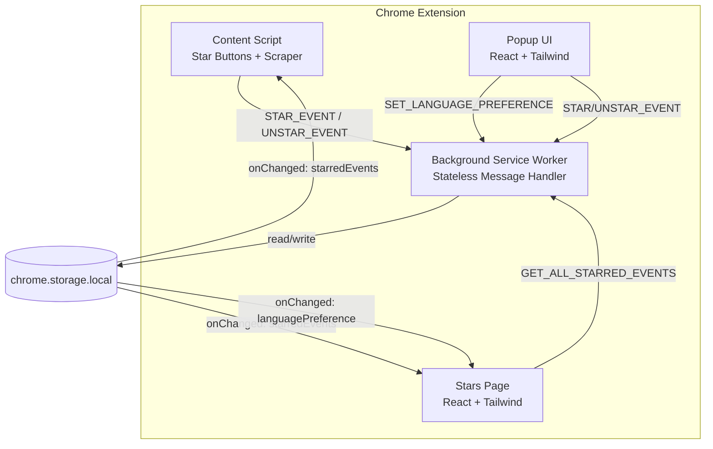

# Design Document: Content Scraping and Sync

## Overview

This feature addresses five related issues in the Almedalsstjärnan Chrome extension:

1. **Star Button Animation Stability** — Prevent unrelated star buttons from re-rendering when one button changes state, eliminating visual "jumping."
2. **Comprehensive Content Scraping** — Expand the Event_Normalizer to extract all 5 content sections from Event_Card detail areas.
3. **ICS Export with Full Content** — Ensure the ICS DESCRIPTION field contains the full multi-section scraped content with proper RFC 5545 escaping.
4. **Stars Page Language Sync** — Live-sync language preference changes from the popup to the stars page.
5. **Stars Page Star Sync** — Real-time sync of starred events between popup and stars page (refinement of existing behavior).

All changes stay within the existing architecture: Manifest V3, TypeScript strict mode, React functional components, Tailwind for UI pages, Shadow DOM for star buttons, and all chrome.* access through `IBrowserApiAdapter`.

## Architecture

### System Context



### Data Flow for Each Feature

**1. Star Button Animation Guard:**
```
update(newState) → if (newState === currentState) return → skip DOM mutation
                 → if (newState !== currentState) → render() → animate only on false→true
```

**2. Content Scraping Pipeline:**
```
Event_Card DOM → findContentSections() → for each h3 heading in known set:
    → collect sibling <p> elements until next h3 or container end
    → trim, filter empty, join with \n
    → prefix with "Heading:\n"
→ join sections with \n\n → trim → truncate to 10000 chars → description field
```

**3. ICS Description Assembly:**
```
StarredEvent.description + StarredEvent.sourceUrl
    → buildDescription(description, sourceUrl, locale)
    → escapeICSText(result)
    → foldLine("DESCRIPTION:" + escaped)
    → output in VEVENT block
```

**4. Language Preference Sync:**
```
Popup: SET_LANGUAGE_PREFERENCE → storage.local.languagePreference = 'en'
    → chrome.storage.onChanged fires
    → Stars Page: onStorageChanged callback
    → detect 'languagePreference' key → extract newValue
    → setLocale(newValue) → React re-render with new locale
```

**5. Star Changes Sync (already partially implemented):**
```
Popup: UNSTAR_EVENT → storage.local.starredEvents updated
    → chrome.storage.onChanged fires
    → Stars Page: onStorageChanged callback
    → detect 'starredEvents' key → fetchEvents(currentSortOrder)
    → discard stale responses via generation counter
    → clean up selectedIds for removed events
```

## Components and Interfaces

### 1. Star Button Update Guard (star-button.ts)

**Current behavior:** `update(starred)` always calls `render()`, reassigning `innerHTML` and attributes, which triggers the CSS `star-pop` animation on all buttons receiving `aria-pressed="true"`.

**New behavior:** Add a state check before `render()`.

```typescript
// In createStarButton return object:
update(newStarred: boolean): void {
  if (newStarred === starred) return; // ← Guard: skip if no change
  starred = newStarred;
  render();
}
```

This single-line guard prevents:
- Redundant DOM mutations on `updateAllButtonsForEvent` calls
- CSS animation retriggering on cross-tab storage sync for unchanged buttons
- Visual "jumping" of unrelated buttons during batch updates

### 2. Content Section Scraper (event-normalizer.ts)

**New function:** `extractContentSections(element: Element): string | null`

Replaces the existing `extractDomDescription` which only extracts `.description`.

```typescript
/** Known content section headings in the Event_Card detail area. */
const CONTENT_SECTION_HEADINGS = [
  'Beskrivning av samhällsfrågan',
  'Utökad information om evenemanget',
  'Medverkande',
  'Evenemangsinformation',
  'Arrangörsuppgifter',
] as const;

/** Maximum characters for the assembled description field. */
const MAX_DESCRIPTION_LENGTH = 10000;

interface ContentSection {
  readonly heading: string;
  readonly paragraphs: readonly string[];
}

/**
 * Extracts all content sections from an Event_Card's collapse container.
 * 
 * Walks h3 elements within the collapse div, identifies known headings,
 * and collects sibling paragraph text until the next h3 or end of container.
 * 
 * @returns Formatted description string or null if no sections found.
 */
function extractContentSections(element: Element): string | null {
  // Find the collapse container (div.env-collapse)
  const collapseDiv = element.querySelector('div.env-collapse');
  if (!collapseDiv) return null;

  const sections: ContentSection[] = [];

  // Get all direct h3 children within the collapse div
  const headings = collapseDiv.querySelectorAll(':scope > h3');

  for (const h3 of headings) {
    const headingText = h3.textContent?.trim() ?? '';
    if (!CONTENT_SECTION_HEADINGS.includes(headingText as typeof CONTENT_SECTION_HEADINGS[number])) {
      continue;
    }

    // Collect sibling <p> elements following this h3 until next h3 or end
    const paragraphs: string[] = [];
    let sibling = h3.nextElementSibling;

    while (sibling && sibling.tagName !== 'H3') {
      if (sibling.tagName === 'P') {
        const text = sibling.textContent?.trim() ?? '';
        if (text.length > 0) {
          paragraphs.push(text);
        }
      }
      sibling = sibling.nextElementSibling;
    }

    if (paragraphs.length > 0) {
      sections.push({ heading: headingText, paragraphs });
    }
  }

  if (sections.length === 0) return null;

  // Assemble: "Heading:\nparagraph1\nparagraph2\n\nHeading2:\nparagraph3"
  const assembled = sections
    .map(s => `${s.heading}:\n${s.paragraphs.join('\n')}`)
    .join('\n\n');

  const trimmed = assembled.trim();
  if (trimmed.length === 0) return null;

  // Truncate to max length
  return trimmed.length > MAX_DESCRIPTION_LENGTH
    ? trimmed.slice(0, MAX_DESCRIPTION_LENGTH)
    : trimmed;
}
```

**Integration point:** The `normalizeEvent` function replaces `extractDomDescription(element)` with `extractContentSections(element)`:

```typescript
// Before (current):
const domDescription = extractDomDescription(element);

// After:
const domDescription = extractContentSections(element);
```

The ICS-embedded description (from the `data:text/calendar` URI) is still used as a primary source via `icsFields?.description`. The comprehensive DOM extraction serves as the fallback when no ICS data is available, and as the richer source when the ICS description is a short summary.

**Priority change:** The description should prefer the comprehensive DOM extraction over the ICS short summary:

```typescript
// Before:
const description = trimOrNull(icsFields?.description ?? domDescription);

// After — prefer longer DOM content over terse ICS description:
const description = trimOrNull(domDescription ?? icsFields?.description);
```

### 3. ICS Generator Enhancement (ics-generator.ts)

The existing `buildDescription`, `escapeICSText`, and `foldLine` functions already handle the requirements correctly. No functional changes needed to these functions.

The `buildDescription` function already:
- Concatenates description + source URL with locale label
- Returns null when both are null
- Formats: `description\nKälla: url` or `description\nSource: url`

The `escapeICSText` function already handles `\`, `,`, `;`, and `\n` escaping.
The `foldLine` function already splits at 75-octet boundaries.

**Verification needed:** With much longer descriptions (up to 10000 chars), ensure `foldLine` handles large inputs efficiently. The current implementation uses `TextEncoder/TextDecoder` which handles multi-byte characters correctly.

### 4. Stars Page Language Sync (useStarredEvents.ts + App.tsx)

**Current state:** The Stars Page `App.tsx` fetches `languagePreference` once on mount. The `useStarredEvents` hook's storage listener only handles `starredEvents` changes.

**Design:** Extend the existing `adapter.onStorageChanged` listener in `App.tsx` to also detect `languagePreference` changes.

```typescript
// In App.tsx — new effect that listens for language changes:
useEffect(() => {
  const unsubscribe = adapter.onStorageChanged((changes) => {
    if ('languagePreference' in changes) {
      const newLocale = changes.languagePreference?.newValue as 'sv' | 'en' | null ?? null;
      setLocale(newLocale);
    }
  });

  return unsubscribe;
}, [adapter]);
```

**Alternative:** Move the language listener into `useStarredEvents` hook alongside the existing `starredEvents` listener. This satisfies Requirement 4.4 (single listener for both).

**Preferred approach:** Consolidate into one listener in `useStarredEvents`:

```typescript
// In useStarredEvents hook:
useEffect(() => {
  const unsubscribe = adapter.onStorageChanged((changes) => {
    if ('starredEvents' in changes) {
      void fetchEvents(sortOrderRef.current);
    }
    if ('languagePreference' in changes) {
      onLanguageChange?.(changes.languagePreference?.newValue as 'sv' | 'en' | null ?? null);
    }
  });

  return unsubscribe;
}, [adapter, fetchEvents, onLanguageChange]);
```

The hook accepts an optional `onLanguageChange` callback, and `App.tsx` passes `setLocale`:

```typescript
const { events, ... } = useStarredEvents(adapter, locale, {
  onLanguageChange: setLocale,
});
```

### 5. Stars Page Event Sync Enhancement

The existing implementation already handles:
- Re-fetching on `starredEvents` storage changes
- Discarding stale responses via `fetchGenerationRef`
- Preserving sort order and filter text

**Remaining gap:** Clean up `selectedIds` when events disappear from the updated list.

```typescript
// After setting events from fetchEvents, clean up stale selections:
const newEventIds = new Set(sorted.map(e => e.id));
setSelectedIds(prev => {
  const cleaned = new Set([...prev].filter(id => newEventIds.has(id)));
  return cleaned.size === prev.size ? prev : cleaned;
});
```

## Data Models

### Updated NormalizedEvent (no schema change needed)

The `description` field type remains `string | null`. The only change is what populates it — the comprehensive multi-section content instead of a single `.description` element.

### Content Section Internal Type

```typescript
interface ContentSection {
  readonly heading: string;
  readonly paragraphs: readonly string[];
}
```

### useStarredEvents Hook Signature Update

```typescript
interface UseStarredEventsOptions {
  readonly onLanguageChange?: (locale: 'sv' | 'en' | null) => void;
}

export function useStarredEvents(
  adapter: IBrowserApiAdapter,
  languagePreference: SupportedLocale | null,
  options?: UseStarredEventsOptions,
): UseStarredEventsResult;
```

## Correctness Properties

*A property is a characteristic or behavior that should hold true across all valid executions of a system — essentially, a formal statement about what the system should do. Properties serve as the bridge between human-readable specifications and machine-verifiable correctness guarantees.*

### Property 1: Star Button Update Idempotence

*For any* Star_Button in state S (true or false), calling `update(S)` (the same state) shall not modify any DOM attributes, innerHTML, or trigger any CSS animation class changes.

**Validates: Requirements 1.1, 1.4**

### Property 2: Star Button Animation Direction

*For any* Star_Button state transition from `oldState` to `newState` where `oldState !== newState`, the `star-pop` animation shall be triggered if and only if `newState === true` (transitioning to starred).

**Validates: Requirements 1.2, 1.3, 1.5**

### Property 3: Star Button Isolation

*For any* set of N Star_Buttons with distinct event IDs and arbitrary initial states, calling `updateAllButtonsForEvent(targetId, newState)` shall leave all Star_Buttons whose event ID differs from `targetId` with unchanged DOM state.

**Validates: Requirements 1.6**

### Property 4: Content Section Extraction Completeness

*For any* Event_Card DOM containing a non-empty subset of the 5 known content headings, each with at least one non-whitespace paragraph, the Content_Scraper shall produce a non-null description containing each heading's label followed by a colon, a newline, and the trimmed paragraph text, with sections separated by `\n\n` in DOM order.

**Validates: Requirements 2.1, 2.2, 2.3, 2.4, 2.5, 2.6, 2.8, 2.9, 2.10**

### Property 5: Content Description Length Invariant

*For any* Event_Card DOM producing a non-null description, the final description string length shall be at most 10000 characters.

**Validates: Requirements 2.11**

### Property 6: ICS Text Escape Round-Trip

*For any* string containing arbitrary characters (including `\`, `,`, `;`, and `\n`), applying `escapeICSText` and then the corresponding unescape operation shall produce the original string.

**Validates: Requirements 3.1, 3.2, 3.3**

### Property 7: ICS Line Folding Octet Limit

*For any* input string, after applying `foldLine`, every resulting line (split by CRLF) shall be at most 75 octets in UTF-8 encoding.

**Validates: Requirements 3.4**

### Property 8: ICS Description Assembly With Source URL

*For any* (description, sourceUrl, locale) triple where sourceUrl is non-null, `buildDescription` shall produce output ending with `\n{label} {sourceUrl}` where label is "Källa:" when locale is 'sv' and "Source:" otherwise.

**Validates: Requirements 3.5**

### Property 9: Selection State Cleanup on Event List Change

*For any* set of selected event IDs and an updated event list, the resulting selection state shall equal the intersection of the selected IDs and the IDs present in the updated event list.

**Validates: Requirements 5.4**

### Property 10: Fetch Generation Staleness

*For any* sequence of N concurrent fetch operations triggered by rapid storage changes, only the response from the Nth (latest) fetch shall be applied to the component state, and all earlier responses shall be discarded.

**Validates: Requirements 5.5**

## Error Handling

| Scenario | Behavior |
|----------|----------|
| Content section heading not found | Return null description (graceful degradation) |
| Collapse div missing from Event_Card | Fall back to ICS description field |
| DOM paragraph text is only whitespace | Exclude from section output |
| Description exceeds 10000 chars | Truncate silently (no error) |
| Storage listener fires with malformed data | Ignore change, keep current state |
| `fetchEvents` throws during re-sync | Catch in async handler, log warning, retain current state |
| Multiple rapid storage changes | Generation counter discards stale responses |
| Star button `update()` called after `destroy()` | No-op (button already removed from DOM) |

## Testing Strategy

### Property-Based Tests (fast-check, minimum 100 iterations)

| Property | Test File | What's Generated |
|----------|-----------|------------------|
| P1: Update idempotence | `content-scraping-sync.property.test.ts` | Random boolean states, random call sequences |
| P2: Animation direction | Same file | Random (old, new) state pairs where old ≠ new |
| P3: Button isolation | Same file | N buttons with random IDs and states, one target |
| P4: Section extraction | Same file | Random subsets of headings, random paragraph content |
| P5: Length invariant | Same file | Very long paragraph content (up to 20000 chars) |
| P6: Escape round-trip | Same file | Arbitrary Unicode strings with special chars |
| P7: Fold octet limit | Same file | Arbitrary long strings including multi-byte UTF-8 |
| P8: Description assembly | Same file | Random (description, url, locale) triples |
| P9: Selection cleanup | Same file | Random sets of selected IDs and event ID lists |
| P10: Fetch generation | Same file | Random sequences of concurrent fetches |

**Library:** fast-check  
**Configuration:** `numRuns: 100`  
**Tag format:** `// Feature: content-scraping-and-sync, Property {N}: {title}`

### Unit Tests (Vitest)

| Module | Test Coverage |
|--------|--------------|
| `star-button.ts` | Guard no-op, animation on star, no animation on unstar |
| `event-normalizer.ts` | Full section extraction, null on empty, truncation boundary |
| `ics-generator.ts` | Long descriptions, multi-section content in DESCRIPTION |
| `useStarredEvents.ts` | Language change callback, selection cleanup |
| Stars `App.tsx` | Language sync re-render, locale propagation to export |

### Integration Tests

| Flow | What's Verified |
|------|----------------|
| Popup star → Stars page update | Event appears in grid after storage change |
| Popup language change → Stars page | All strings update to new locale |
| Content script star → Cross-tab sync | Other tab's star buttons reflect new state |

### DOM Test Fixtures

Use the existing `fixtures/almedalsveckan-program-2026.html` for content scraper tests. Add DOM helper functions in `tests/helpers/dom-helpers.ts` for generating Event_Cards with configurable content sections.
