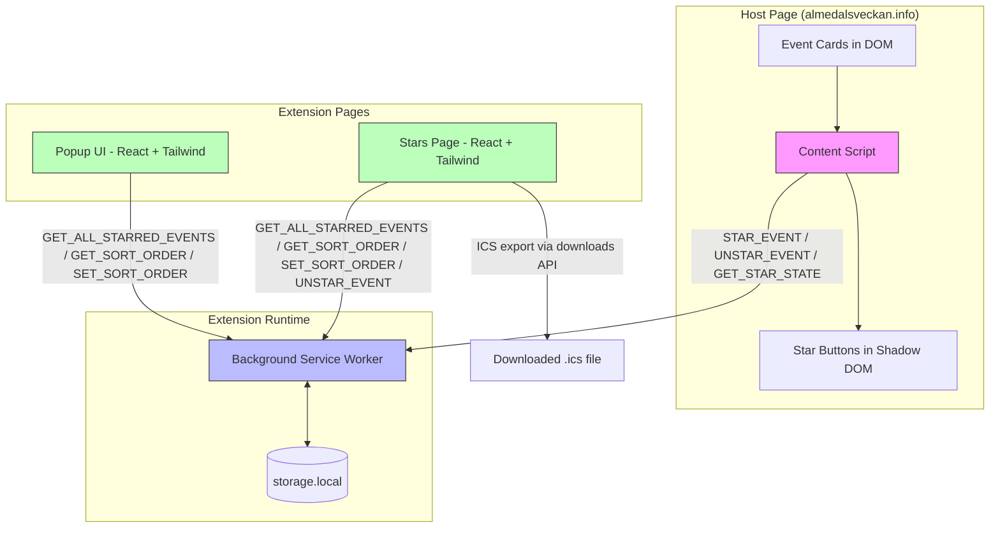
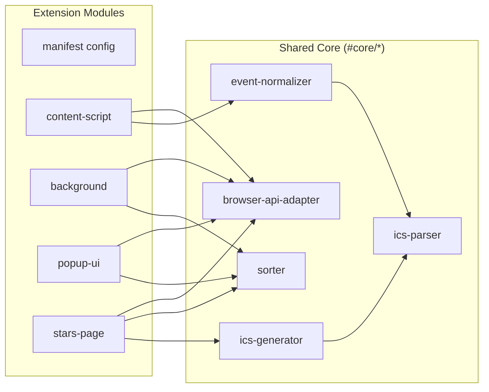
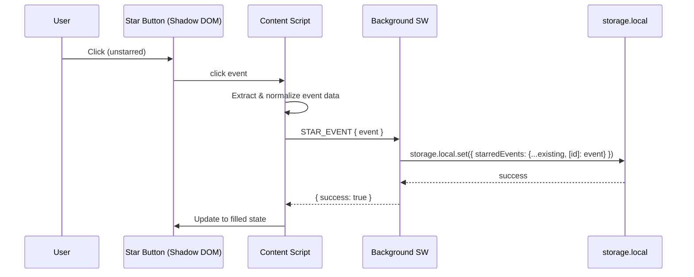
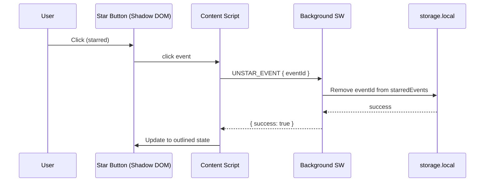
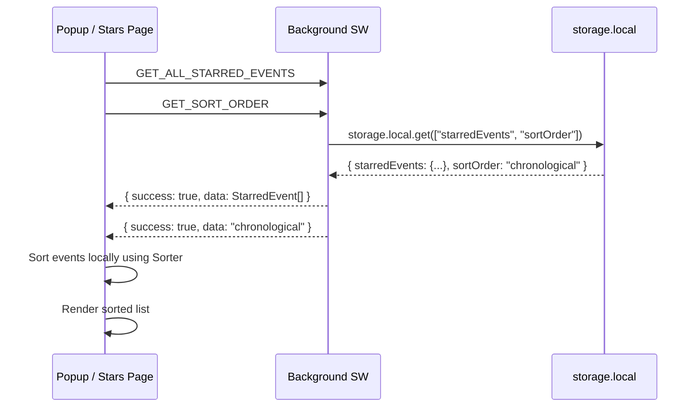
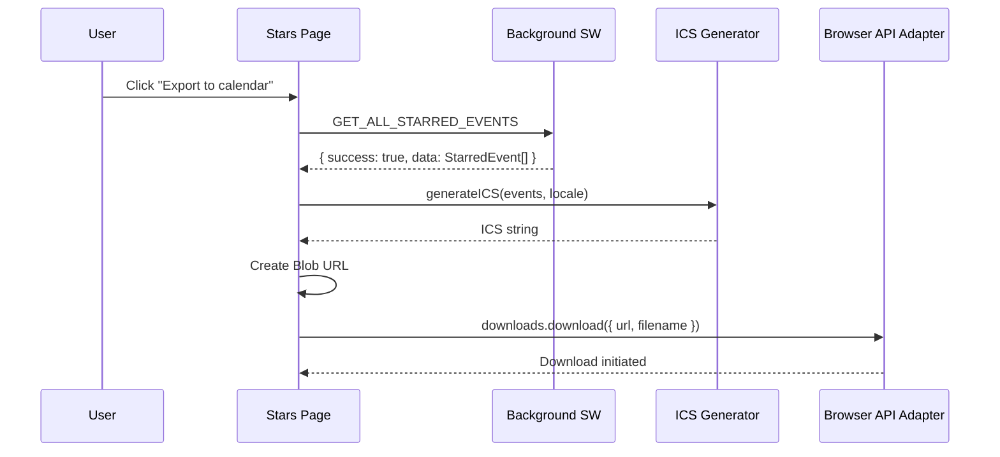
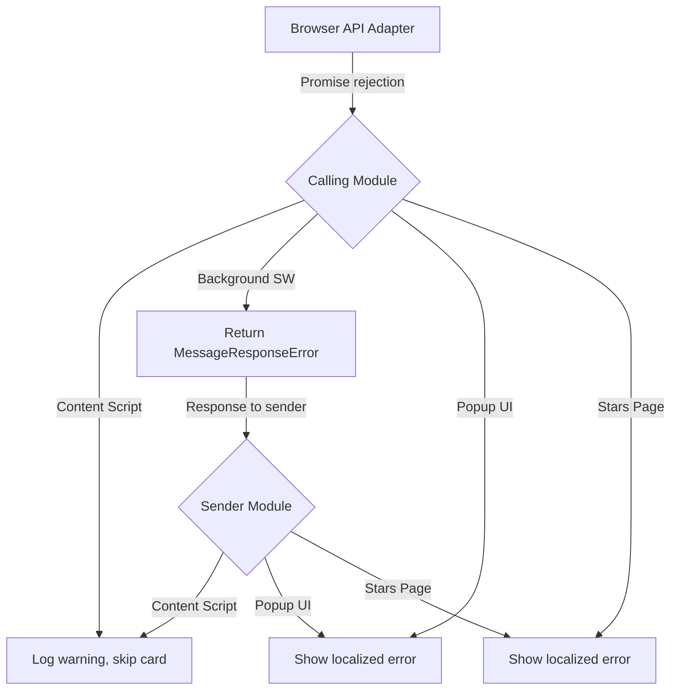

# Design Document: Almedalsstjärnan Browser Extension

## Overview

Almedalsstjärnan is a Chrome-first, WebExtensions-compatible Manifest V3 browser extension that lets users star events on the official Almedalsveckan programme website (almedalsveckan.info), view starred events in a dedicated page, sort them, and export the full schedule as an RFC 5545-compliant ICS calendar file.

The extension follows a message-passing architecture where a content script injects Shadow DOM-isolated star buttons into host pages, a background service worker manages persistent storage, and two React-based UI surfaces (popup and stars page) present starred event data. All browser API access is mediated through a single adapter module, enabling comprehensive unit testing with mocks. The shared core provides five pure-logic submodules (ICS parser, ICS generator, event normalizer, sorter, browser API adapter) that are consumed by all extension entry points.

**Key design decisions and rationale:**

| Decision | Rationale |
|---|---|
| Shadow DOM for star buttons | Complete style isolation from host page CSS; no Tailwind leak into content script |
| Single MutationObserver | Server-rendered pages with dynamic updates; one observer handles both initial scan and late-arriving cards |
| Background service worker as single source of truth | Manifest V3 requirement; centralizes storage access; enables cross-tab consistency |
| Browser API adapter | All `chrome.*` calls behind one injectable interface; unit tests never touch real browser APIs |
| `vite-plugin-web-extension` (aklinker1) | Handles multi-entry bundling (content script, background, popup, stars page), manifest processing, and HMR in a single plugin |
| `fast-check` for property-based tests | Validates ICS round-trip, sorter idempotence, and normalizer invariants across thousands of generated inputs |
| Path aliases with `#` prefix | Avoids conflict with npm scoped packages (`@`); clear visual distinction for internal imports |
| Manual semver 0.x.x | Pre-1.0 development; no automated release tooling needed yet |

## Architecture

### High-Level Architecture Diagram



### Module Dependency Diagram



### Data Flow: Star Event



### Data Flow: Unstar Event



### Data Flow: List Starred Events (Popup / Stars Page)



### Data Flow: ICS Export



## Components and Interfaces

### Directory Structure

```
almedalsstjarnan/
├── .github/
│   └── workflows/
│       └── ci.yml
├── .kiro/
│   ├── hooks/
│   │   ├── lint-on-save.kiro.md
│   │   ├── test-on-save.kiro.md
│   │   └── typecheck-on-save.kiro.md
│   ├── specs/
│   │   └── almedals-planner-extension/
│   │       ├── .config.kiro
│   │       ├── requirements.md
│   │       ├── design.md
│   │       └── tasks.md
│   └── steering/
│       ├── coding-conventions.md
│       ├── testing-standards.md
│       ├── browser-extension-patterns.md
│       ├── accessibility-standards.md
│       ├── i18n-guide.md
│       └── commit-messages.md
├── _locales/
│   ├── sv/
│   │   └── messages.json
│   └── en/
│       └── messages.json
├── fixtures/
│   └── almedalsveckan-program-2026.html
├── src/
│   ├── core/
│   │   ├── browser-api-adapter.ts
│   │   ├── event-normalizer.ts
│   │   ├── ics-generator.ts
│   │   ├── ics-parser.ts
│   │   ├── sorter.ts
│   │   ├── types.ts
│   │   └── index.ts
│   ├── extension/
│   │   ├── background.ts
│   │   ├── content-script.ts
│   │   ├── star-button.ts
│   │   ├── star-button.css
│   │   └── manifest/
│   │       ├── base.json
│   │       ├── chrome.json
│   │       └── merge-manifest.ts
│   ├── ui/
│   │   ├── popup/
│   │   │   ├── popup.html
│   │   │   ├── popup.tsx
│   │   │   ├── popup.css
│   │   │   ├── App.tsx
│   │   │   ├── components/
│   │   │   │   ├── EventList.tsx
│   │   │   │   ├── EventItem.tsx
│   │   │   │   ├── SortSelector.tsx
│   │   │   │   └── EmptyState.tsx
│   │   │   └── hooks/
│   │   │       └── useStarredEvents.ts
│   │   ├── stars/
│   │   │   ├── stars.html
│   │   │   ├── stars.tsx
│   │   │   ├── stars.css
│   │   │   ├── App.tsx
│   │   │   ├── components/
│   │   │   │   ├── EventGrid.tsx
│   │   │   │   ├── EventRow.tsx
│   │   │   │   ├── SortSelector.tsx
│   │   │   │   ├── ExportButton.tsx
│   │   │   │   └── EmptyState.tsx
│   │   │   └── hooks/
│   │   │       └── useStarredEvents.ts
│   │   └── shared/
│   │       └── SortSelector.tsx
│   └── features/
│       └── (reserved for future feature modules)
├── tests/
│   ├── unit/
│   │   ├── core/
│   │   │   ├── browser-api-adapter.test.ts
│   │   │   ├── event-normalizer.test.ts
│   │   │   ├── ics-generator.test.ts
│   │   │   ├── ics-parser.test.ts
│   │   │   └── sorter.test.ts
│   │   ├── extension/
│   │   │   ├── background.test.ts
│   │   │   ├── content-script.test.ts
│   │   │   ├── star-button.test.ts
│   │   │   └── merge-manifest.test.ts
│   │   └── ui/
│   │       ├── popup/
│   │       │   └── App.test.tsx
│   │       └── stars/
│   │           └── App.test.tsx
│   ├── property/
│   │   ├── ics-roundtrip.property.test.ts
│   │   ├── sorter-idempotence.property.test.ts
│   │   ├── sorter-length.property.test.ts
│   │   ├── normalizer-trim.property.test.ts
│   │   └── normalizer-required-fields.property.test.ts
│   ├── e2e/
│   │   ├── star-unstar.e2e.test.ts
│   │   └── ics-export.e2e.test.ts
│   └── helpers/
│       ├── mock-browser-api.ts
│       ├── event-generators.ts
│       └── dom-helpers.ts
├── icons/
│   ├── icon-16.png
│   ├── icon-32.png
│   ├── icon-48.png
│   └── icon-128.png
├── .eslintrc.cjs
├── .prettierrc.json
├── .nvmrc
├── package.json
├── pnpm-lock.yaml
├── tsconfig.json
├── tsconfig.node.json
├── vite.config.ts
├── tailwind.config.ts
├── postcss.config.cjs
├── vitest.config.ts
├── playwright.config.ts
└── README.md
```

### Build Output Structure

```
dist/
├── manifest.json              # Merged manifest (base + chrome override)
├── _locales/
│   ├── sv/
│   │   └── messages.json
│   └── en/
│       └── messages.json
├── background.js              # Background service worker bundle
├── content-script.js          # Content script bundle (< 50KB)
├── content-script.css         # (empty or minimal — styles are in Shadow DOM)
├── popup.html
├── popup.js                   # Popup React bundle
├── popup.css                  # Popup Tailwind CSS
├── stars.html
├── stars.js                   # Stars page React bundle
├── stars.css                  # Stars page Tailwind CSS
└── icons/
    ├── icon-16.png
    ├── icon-32.png
    ├── icon-48.png
    └── icon-128.png
```


### TypeScript Interfaces and Types (`src/core/types.ts`)

```typescript
// ─── Event Identity ───────────────────────────────────────────────

/** Unique event identifier derived from ICS URL path, detail-page URL, or SHA-256 hash fallback */
export type EventId = string;

// ─── Sort Order ───────────────────────────────────────────────────

export const SORT_ORDERS = [
  'chronological',
  'reverse-chronological',
  'alphabetical-by-title',
  'starred-desc',
] as const;

export type SortOrder = (typeof SORT_ORDERS)[number];

export const DEFAULT_SORT_ORDER: SortOrder = 'chronological';

// ─── Normalized Event ─────────────────────────────────────────────

export interface NormalizedEvent {
  /** Unique event identifier */
  readonly id: EventId;
  /** Event title (required, trimmed) */
  readonly title: string;
  /** Organiser name (optional, trimmed) */
  readonly organiser: string | null;
  /** ISO 8601 start date-time with timezone (required) */
  readonly startDateTime: string;
  /** ISO 8601 end date-time with timezone (optional) */
  readonly endDateTime: string | null;
  /** Event location (optional, trimmed) */
  readonly location: string | null;
  /** Event description (optional, trimmed) */
  readonly description: string | null;
  /** Event topic/category (optional, trimmed) */
  readonly topic: string | null;
  /** Source URL on almedalsveckan.info (optional) */
  readonly sourceUrl: string | null;
  /** Raw ICS data URI from the data:text/calendar anchor href */
  readonly icsDataUri: string | null;
}

// ─── Starred Event (persisted) ────────────────────────────────────

export interface StarredEvent extends NormalizedEvent {
  /** Whether the event is currently starred (always true when in storage) */
  readonly starred: true;
  /** Timestamp when the event was starred (ISO 8601) */
  readonly starredAt: string;
}

// ─── Storage Schema ───────────────────────────────────────────────

export interface StorageSchema {
  /** Object keyed by EventId, values are StarredEvent objects */
  starredEvents: Record<EventId, StarredEvent>;
  /** Current sort order preference */
  sortOrder: SortOrder;
}

// ─── Message Protocol ─────────────────────────────────────────────

export const MESSAGE_COMMANDS = [
  'STAR_EVENT',
  'UNSTAR_EVENT',
  'GET_STAR_STATE',
  'GET_ALL_STARRED_EVENTS',
  'GET_SORT_ORDER',
  'SET_SORT_ORDER',
] as const;

export type MessageCommand = (typeof MESSAGE_COMMANDS)[number];

export interface StarEventPayload {
  readonly command: 'STAR_EVENT';
  readonly event: NormalizedEvent;
}

export interface UnstarEventPayload {
  readonly command: 'UNSTAR_EVENT';
  readonly eventId: EventId;
}

export interface GetStarStatePayload {
  readonly command: 'GET_STAR_STATE';
  readonly eventId: EventId;
}

export interface GetAllStarredEventsPayload {
  readonly command: 'GET_ALL_STARRED_EVENTS';
}

export interface GetSortOrderPayload {
  readonly command: 'GET_SORT_ORDER';
}

export interface SetSortOrderPayload {
  readonly command: 'SET_SORT_ORDER';
  readonly sortOrder: SortOrder;
}

export type MessagePayload =
  | StarEventPayload
  | UnstarEventPayload
  | GetStarStatePayload
  | GetAllStarredEventsPayload
  | GetSortOrderPayload
  | SetSortOrderPayload;

export interface MessageResponseSuccess<T = unknown> {
  readonly success: true;
  readonly data: T;
}

export interface MessageResponseError {
  readonly success: false;
  readonly error: string;
}

export type MessageResponse<T = unknown> =
  | MessageResponseSuccess<T>
  | MessageResponseError;

// ─── Response type map per command ────────────────────────────────

export type StarEventResponse = MessageResponse<void>;
export type UnstarEventResponse = MessageResponse<void>;
export type GetStarStateResponse = MessageResponse<boolean>;
export type GetAllStarredEventsResponse = MessageResponse<StarredEvent[]>;
export type GetSortOrderResponse = MessageResponse<SortOrder>;
export type SetSortOrderResponse = MessageResponse<void>;

// ─── Event Normalizer Result ──────────────────────────────────────

export interface NormalizerSuccess {
  readonly ok: true;
  readonly event: NormalizedEvent;
}

export interface NormalizerError {
  readonly ok: false;
  readonly reason: string;
  readonly missingField?: string;
}

export type NormalizerResult = NormalizerSuccess | NormalizerError;

// ─── ICS Types ────────────────────────────────────────────────────

export interface ICSEvent {
  readonly uid: string;
  readonly dtstart: string;
  readonly dtend: string | null;
  readonly summary: string;
  readonly location: string | null;
  readonly description: string | null;
  readonly organizer: string | null;
}

export interface ICSCalendar {
  readonly version: string;
  readonly prodid: string;
  readonly calscale: string;
  readonly method: string;
  readonly events: readonly ICSEvent[];
}

// ─── Browser API Adapter Interface ────────────────────────────────

export interface IBrowserApiAdapter {
  storageLocalGet<K extends keyof StorageSchema>(
    keys: K[]
  ): Promise<Partial<Pick<StorageSchema, K>>>;

  storageLocalSet(items: Partial<StorageSchema>): Promise<void>;

  sendMessage<T>(message: MessagePayload): Promise<MessageResponse<T>>;

  getMessage(key: string): string;

  download(options: { url: string; filename: string }): Promise<number>;

  createTab(options: { url: string }): Promise<void>;

  /** Register a listener for storage.onChanged events. Returns an unsubscribe function. */
  onStorageChanged(
    callback: (changes: Record<string, { oldValue?: unknown; newValue?: unknown }>) => void
  ): () => void;
}
```

### Module APIs

#### 1. Browser API Adapter (`src/core/browser-api-adapter.ts`)

```typescript
import type { IBrowserApiAdapter, StorageSchema, MessagePayload, MessageResponse } from './types';

/**
 * Production implementation wrapping chrome.* APIs.
 * This is the SOLE module that directly references chrome.* globals.
 */
export class BrowserApiAdapter implements IBrowserApiAdapter {
  async storageLocalGet<K extends keyof StorageSchema>(
    keys: K[]
  ): Promise<Partial<Pick<StorageSchema, K>>>;

  async storageLocalSet(items: Partial<StorageSchema>): Promise<void>;

  async sendMessage<T>(message: MessagePayload): Promise<MessageResponse<T>>;

  getMessage(key: string): string;

  async download(options: { url: string; filename: string }): Promise<number>;

  async createTab(options: { url: string }): Promise<void>;

  onStorageChanged(
    callback: (changes: Record<string, { oldValue?: unknown; newValue?: unknown }>) => void
  ): () => void;
}

/**
 * Factory function for dependency injection.
 * Tests provide a mock; production uses the real adapter.
 */
export function createBrowserApiAdapter(): IBrowserApiAdapter;
```

#### 2. Event Normalizer (`src/core/event-normalizer.ts`)

```typescript
import type { NormalizerResult } from './types';

/**
 * Extracts and normalizes event data from a DOM element.
 *
 * @param element - The Event_Card or Event_Detail DOM element
 * @returns NormalizerResult — either a NormalizedEvent or an error with reason
 *
 * Extraction rules:
 * - Event ID: ICS URL field path segment > detail-page URL > SHA-256 hash fallback
 * - Title: h2 (card) or h1/h2 (detail block), trimmed
 * - Start/End: Parsed from visible time text, output as ISO 8601 with timezone
 * - Organiser, location, description, topic, sourceUrl: Optional, trimmed
 * - icsDataUri: href from data:text/calendar anchor
 */
export function normalizeEvent(element: Element): NormalizerResult;

/**
 * Generates a stable event ID from available identifiers.
 * Priority: ICS URL path segment > detail-page URL > SHA-256 hash of title+startDateTime
 */
export function deriveEventId(
  icsUrl: string | null,
  detailUrl: string | null,
  title: string,
  startDateTime: string
): string;

/**
 * Parses a visible time text string from the host page into ISO 8601 format.
 */
export function parseDateTime(timeText: string): string | null;
```

#### 3. ICS Generator (`src/core/ics-generator.ts`)

```typescript
import type { StarredEvent, ICSCalendar } from './types';

/**
 * Generates an RFC 5545-compliant ICS string from starred events.
 *
 * VCALENDAR header:
 *   VERSION:2.0
 *   PRODID:-//Almedalsstjärnan//EN
 *   CALSCALE:GREGORIAN
 *   METHOD:PUBLISH
 *
 * Each VEVENT includes:
 *   UID:{event_id}@almedalsstjarnan
 *   DTSTAMP:{utc_timestamp} (export generation time, format YYYYMMDDTHHMMSSZ)
 *   DTSTART:{iso8601}
 *   DTEND:{iso8601} (if end time exists)
 *   SUMMARY:{title}
 *   LOCATION:{location} (if exists)
 *   DESCRIPTION:{description}\n{localizedSourceLabel}: {sourceUrl}
 *   ORGANIZER:{organiser} (if exists)
 *
 * Line folding: lines > 75 octets folded per RFC 5545.
 * Line endings: CRLF (\r\n) throughout.
 *
 * @param events - Array of starred events to include
 * @param locale - 'sv' or 'en' for source label localization
 * @returns Complete ICS file content as a string
 */
export function generateICS(events: readonly StarredEvent[], locale: 'sv' | 'en'): string;

/**
 * Folds a single ICS content line to 75-octet maximum per RFC 5545.
 */
export function foldLine(line: string): string;

/**
 * Escapes special characters in ICS text values (commas, semicolons, backslashes, newlines).
 */
export function escapeICSText(text: string): string;

/**
 * Generates the export filename with current timestamp.
 * Pattern: almedalsstjarnan-starred-events-YYYYMMDD-HHMMSS.ics
 */
export function generateExportFilename(now?: Date): string;
```

#### 4. ICS Parser (`src/core/ics-parser.ts`)

```typescript
import type { ICSCalendar, ICSEvent } from './types';

/**
 * Parses an ICS string into a structured ICSCalendar object.
 * Used for round-trip validation in property-based tests.
 *
 * @param icsContent - Raw ICS file content
 * @returns Parsed calendar with events
 * @throws Error if the ICS content is malformed
 */
export function parseICS(icsContent: string): ICSCalendar;

/**
 * Unfolds continuation lines per RFC 5545 (CRLF followed by single whitespace).
 */
export function unfoldLines(content: string): string;

/**
 * Unescapes ICS text values.
 */
export function unescapeICSText(text: string): string;
```

#### 5. Sorter (`src/core/sorter.ts`)

```typescript
import type { StarredEvent, SortOrder } from './types';

/**
 * Returns a new array of events sorted by the specified order.
 * Does NOT mutate the input array.
 *
 * Sort orders:
 * - chronological: startDateTime ascending, tiebreaker: id ascending
 * - reverse-chronological: startDateTime descending, tiebreaker: id ascending
 * - alphabetical-by-title: title ascending (locale-aware), tiebreaker: id ascending
 * - starred-desc: starredAt descending, tiebreaker: startDateTime ascending
 *
 * @param events - Array of starred events
 * @param order - One of the four SortOrder values
 * @returns New sorted array
 */
export function sortEvents(
  events: readonly StarredEvent[],
  order: SortOrder
): StarredEvent[];
```

#### 6. Background Service Worker (`src/extension/background.ts`)

```typescript
/**
 * Registers chrome.runtime.onMessage listener.
 * Dispatches incoming MessagePayload to handler functions.
 * All storage operations go through BrowserApiAdapter.
 *
 * Handler map:
 *   STAR_EVENT          → addStarredEvent(event) → StarEventResponse
 *   UNSTAR_EVENT        → removeStarredEvent(eventId) → UnstarEventResponse
 *   GET_STAR_STATE      → isEventStarred(eventId) → GetStarStateResponse
 *   GET_ALL_STARRED_EVENTS → getAllStarredEvents() → GetAllStarredEventsResponse
 *   GET_SORT_ORDER      → getSortOrder() → GetSortOrderResponse
 *   SET_SORT_ORDER      → setSortOrder(order) → SetSortOrderResponse
 *
 * Default values:
 *   starredEvents: {} (empty object, returned as empty array)
 *   sortOrder: "chronological"
 *
 * Error handling:
 *   All handlers catch errors and return MessageResponseError with descriptive message.
 */
```

#### 7. Content Script (`src/extension/content-script.ts`)

```typescript
/**
 * Entry point injected into almedalsveckan.info programme pages.
 *
 * Lifecycle:
 * 1. On load: scan existing DOM for Event_Cards, inject Star_Buttons
 * 2. Create ONE MutationObserver on document.body (childList, subtree)
 * 3. On mutation: process new Event_Cards in added nodes
 *
 * Processing per Event_Card:
 * 1. Check for data-almedals-planner-initialized="1" → skip if present
 * 2. Call normalizeEvent(element) → skip on error (log warning)
 * 3. Create Shadow DOM host container
 * 4. Render StarButton inside Shadow DOM
 * 5. Send GET_STAR_STATE to determine initial state
 * 6. Set data-almedals-planner-initialized="1"
 */

export function initContentScript(adapter: IBrowserApiAdapter): void;

export function processEventCard(
  card: Element,
  adapter: IBrowserApiAdapter
): Promise<void>;

export function isEventCard(element: Element): boolean;

export function findEventCards(root: Element | Document): Element[];
```

#### 8. Star Button (`src/extension/star-button.ts`)

```typescript
/**
 * Creates and manages a star button inside a Shadow DOM.
 *
 * Shadow DOM structure:
 *   <div class="almedals-star-host">
 *     #shadow-root (open)
 *       <style>/* scoped CSS from star-button.css */</style>
 *       <button
 *         class="star-btn"
 *         aria-pressed="false|true"
 *         aria-label="{localized label}"
 *         type="button"
 *       >
 *         <svg><!-- 16px star icon, filled or outlined --></svg>
 *       </button>
 */

export interface StarButtonOptions {
  readonly eventId: string;
  readonly initialStarred: boolean;
  readonly adapter: IBrowserApiAdapter;
  readonly onStar: (eventId: string) => Promise<void>;
  readonly onUnstar: (eventId: string) => Promise<void>;
}

export function createStarButton(
  hostElement: Element,
  options: StarButtonOptions
): { update: (starred: boolean) => void; destroy: () => void };

/** Inline SVG for outlined (unstarred) star, 16px viewBox */
export const STAR_OUTLINED_SVG: string;

/** Inline SVG for filled (starred) star, 16px viewBox */
export const STAR_FILLED_SVG: string;
```

### Manifest Configuration

#### Base Manifest (`src/extension/manifest/base.json`)

```json
{
  "manifest_version": 3,
  "name": "__MSG_extensionName__",
  "description": "__MSG_extensionDescription__",
  "version": "0.1.0",
  "default_locale": "sv",
  "permissions": ["storage", "downloads", "tabs"],
  "host_permissions": ["*://almedalsveckan.info/*"],
  "background": {
    "service_worker": "background.js",
    "type": "module"
  },
  "content_scripts": [
    {
      "matches": ["*://almedalsveckan.info/*"],
      "js": ["content-script.js"],
      "run_at": "document_idle"
    }
  ],
  "action": {
    "default_popup": "popup.html",
    "default_icon": {
      "16": "icons/icon-16.png",
      "32": "icons/icon-32.png",
      "48": "icons/icon-48.png",
      "128": "icons/icon-128.png"
    }
  },
  "icons": {
    "16": "icons/icon-16.png",
    "32": "icons/icon-32.png",
    "48": "icons/icon-48.png",
    "128": "icons/icon-128.png"
  }
}
```

#### Chrome Override (`src/extension/manifest/chrome.json`)

```json
{
  "minimum_chrome_version": "110"
}
```

#### Manifest Merge Strategy (`src/extension/manifest/merge-manifest.ts`)

```typescript
/**
 * Simple deep-merge of base manifest with per-browser override.
 * Arrays are replaced (not concatenated).
 * Nested objects are recursively merged.
 *
 * Used at build time by vite.config.ts.
 */
export function mergeManifest(
  base: Record<string, unknown>,
  override: Record<string, unknown>
): Record<string, unknown>;
```


## Data Models

### Storage Schema

The extension uses `chrome.storage.local` with two top-level keys:

| Key | Type | Default | Description |
|---|---|---|---|
| `starredEvents` | `Record<EventId, StarredEvent>` | `{}` (empty object) | Object keyed by event ID. Each value is a full `StarredEvent` object. Returned as `StarredEvent[]` (via `Object.values()`) to consumers. |
| `sortOrder` | `SortOrder` | `"chronological"` | One of: `"chronological"`, `"reverse-chronological"`, `"alphabetical-by-title"`, `"starred-desc"` |

**Design decision:** `starredEvents` is stored as an object (not an array) keyed by `EventId` for O(1) lookup/insert/delete. The background service worker converts to an array when responding to `GET_ALL_STARRED_EVENTS`.

### Storage Example

```json
{
  "starredEvents": {
    "abc123": {
      "id": "abc123",
      "title": "Demokrati i förändring",
      "organiser": "Sveriges Riksdag",
      "startDateTime": "2026-06-28T10:00:00+02:00",
      "endDateTime": "2026-06-28T11:30:00+02:00",
      "location": "Donners plats, Visby",
      "description": "Panelsamtal om demokratins framtid",
      "topic": "Demokrati",
      "sourceUrl": "https://almedalsveckan.info/event/abc123",
      "icsDataUri": "data:text/calendar;charset=utf-8,...",
      "starredAt": "2026-06-15T14:30:00.000Z"
    }
  },
  "sortOrder": "chronological"
}
```

### Event Identity Derivation

Event IDs are derived using a priority chain:

1. **ICS URL path segment**: Extract the last meaningful path segment from the `data:text/calendar` anchor's decoded ICS content (the UID field if present)
2. **Detail-page URL**: Extract the path segment from the event's detail page link
3. **SHA-256 hash fallback**: `sha256(title + "|" + startDateTime)` truncated to 16 hex characters

This ensures stable identity across page loads even when ICS data is unavailable.

### Shadow DOM Structure

Each star button is rendered inside an isolated Shadow DOM:

```html
<!-- Injected into Event_Card by content script -->
<div class="almedals-star-host" data-event-id="abc123">
  #shadow-root (open)
    <style>
      /* Scoped CSS — no Tailwind, no host page leakage */
      .star-btn {
        display: inline-flex;
        align-items: center;
        justify-content: center;
        width: 32px;
        height: 32px;
        padding: 0;
        border: none;
        background: transparent;
        cursor: pointer;
        border-radius: 4px;
        transition: background-color 0.15s ease;
      }
      .star-btn:hover {
        background-color: rgba(0, 0, 0, 0.06);
      }
      .star-btn:focus-visible {
        outline: 2px solid #2563eb;
        outline-offset: 2px;
      }
      .star-btn svg {
        width: 16px;
        height: 16px;
      }
      .star-btn[aria-pressed="true"] svg {
        fill: #f59e0b;
        stroke: #f59e0b;
      }
      .star-btn[aria-pressed="false"] svg {
        fill: none;
        stroke: #6b7280;
        stroke-width: 1.5;
      }
    </style>
    <button
      class="star-btn"
      type="button"
      aria-pressed="false"
      aria-label="Stjärnmärk evenemang"
    >
      <svg viewBox="0 0 16 16" xmlns="http://www.w3.org/2000/svg">
        <path d="M8 1.5l1.85 3.75 4.15.6-3 2.93.71 4.12L8 10.77 4.29 12.9l.71-4.12-3-2.93 4.15-.6L8 1.5z"/>
      </svg>
    </button>
</div>
```

**Placement rules:**
- **Event cards (listing pages):** Star button inserted into the title row, after the `<h2>` title element
- **Event detail blocks:** Star button inserted below the `<h1>` or `<h2>` title element

### Vite Configuration (`vite.config.ts`)

```typescript
import { defineConfig } from 'vite';
import webExtension from 'vite-plugin-web-extension';
import react from '@vitejs/plugin-react';
import { resolve } from 'path';
import { mergeManifest } from './src/extension/manifest/merge-manifest';
import baseManifest from './src/extension/manifest/base.json';
import chromeOverride from './src/extension/manifest/chrome.json';

export default defineConfig({
  plugins: [
    react(),
    webExtension({
      manifest: () => mergeManifest(baseManifest, chromeOverride),
      additionalInputs: ['src/ui/stars/stars.html'],
    }),
  ],
  resolve: {
    alias: {
      '#core': resolve(__dirname, 'src/core'),
      '#ui': resolve(__dirname, 'src/ui'),
      '#features': resolve(__dirname, 'src/features'),
      '#extension': resolve(__dirname, 'src/extension'),
      '#test': resolve(__dirname, 'tests'),
    },
  },
  build: {
    outDir: 'dist',
    sourcemap: process.env.NODE_ENV === 'development',
    rollupOptions: {
      output: {
        // Ensure content script stays under 50KB
        manualChunks: undefined,
      },
    },
  },
});
```

### TypeScript Configuration (`tsconfig.json`)

```json
{
  "compilerOptions": {
    "target": "ES2022",
    "module": "ESNext",
    "moduleResolution": "bundler",
    "lib": ["ES2022", "DOM", "DOM.Iterable"],
    "jsx": "react-jsx",
    "strict": true,
    "noUncheckedIndexedAccess": true,
    "noImplicitOverride": true,
    "esModuleInterop": true,
    "skipLibCheck": true,
    "forceConsistentCasingInFileNames": true,
    "resolveJsonModule": true,
    "isolatedModules": true,
    "noEmit": true,
    "paths": {
      "#core/*": ["./src/core/*"],
      "#ui/*": ["./src/ui/*"],
      "#features/*": ["./src/features/*"],
      "#extension/*": ["./src/extension/*"],
      "#test/*": ["./tests/*"]
    },
    "baseUrl": ".",
    "types": ["chrome-types", "vitest/globals"]
  },
  "include": ["src/**/*", "tests/**/*"],
  "exclude": ["node_modules", "dist"]
}
```

### Tailwind Configuration (`tailwind.config.ts`)

```typescript
import type { Config } from 'tailwindcss';

export default {
  // Scoped to popup and stars page ONLY — never content script
  content: [
    './src/ui/popup/**/*.{tsx,ts,html}',
    './src/ui/stars/**/*.{tsx,ts,html}',
    './src/ui/shared/**/*.{tsx,ts}',
  ],
  theme: {
    extend: {},
  },
  plugins: [],
} satisfies Config;
```

### Vitest Configuration (`vitest.config.ts`)

```typescript
import { defineConfig } from 'vitest/config';
import { resolve } from 'path';

export default defineConfig({
  resolve: {
    alias: {
      '#core': resolve(__dirname, 'src/core'),
      '#ui': resolve(__dirname, 'src/ui'),
      '#features': resolve(__dirname, 'src/features'),
      '#extension': resolve(__dirname, 'src/extension'),
      '#test': resolve(__dirname, 'tests'),
    },
  },
  test: {
    globals: true,
    environment: 'jsdom',
    include: [
      'tests/unit/**/*.test.{ts,tsx}',
      'tests/property/**/*.property.test.ts',
    ],
    coverage: {
      provider: 'v8',
      include: ['src/core/**/*.ts'],
      exclude: ['src/core/index.ts', 'src/core/types.ts'],
    },
    setupFiles: ['tests/helpers/mock-browser-api.ts'],
  },
});
```

### Path Alias Configuration

Path aliases are configured in three places to ensure consistency:

| Location | Purpose |
|---|---|
| `tsconfig.json` → `paths` | TypeScript type resolution and IDE support |
| `vite.config.ts` → `resolve.alias` | Build-time module resolution |
| `vitest.config.ts` → `resolve.alias` | Test-time module resolution |

All five aliases:
- `#core/*` → `src/core/*`
- `#ui/*` → `src/ui/*`
- `#features/*` → `src/features/*`
- `#extension/*` → `src/extension/*`
- `#test/*` → `tests/*`

### i18n Message Key Catalog

The complete i18n message key catalog (26 keys × 2 locales) is maintained in a separate file:

**→ #[[file:.kiro/specs/almedals-planner-extension/i18n-catalog.md]]**

That file contains:
- Summary table mapping each key to its Swedish/English value and which module uses it
- Full `_locales/sv/messages.json` content
- Full `_locales/en/messages.json` content

### CI Pipeline (`/.github/workflows/ci.yml`)

```yaml
name: CI

on:
  push:
    branches: [main]
  pull_request:
    branches: [main]

jobs:
  check:
    runs-on: ubuntu-latest
    strategy:
      matrix:
        node-version: [20]

    steps:
      - uses: actions/checkout@v4

      - uses: pnpm/action-setup@v4
        with:
          version: 9

      - uses: actions/setup-node@v4
        with:
          node-version: ${{ matrix.node-version }}
          cache: 'pnpm'

      - name: Install dependencies
        run: pnpm install --frozen-lockfile

      - name: Lint
        run: pnpm run lint

      - name: Type check
        run: pnpm run typecheck

      - name: Unit tests
        run: pnpm run test:unit

      - name: Property-based tests
        run: pnpm run test:property

      - name: Build
        run: pnpm run build

      - name: Verify bundle sizes
        run: |
          CONTENT_SIZE=$(stat -c%s dist/content-script.js 2>/dev/null || echo "0")
          if [ "$CONTENT_SIZE" -gt 51200 ]; then
            echo "Content script bundle exceeds 50KB: ${CONTENT_SIZE} bytes"
            exit 1
          fi
          TOTAL_SIZE=$(du -sb dist/ | cut -f1)
          if [ "$TOTAL_SIZE" -gt 512000 ]; then
            echo "Total package exceeds 500KB: ${TOTAL_SIZE} bytes"
            exit 1
          fi
```

### Package.json Scripts

```json
{
  "scripts": {
    "dev": "vite",
    "build": "vite build",
    "preview": "vite preview",
    "typecheck": "tsc --noEmit",
    "lint": "eslint . --ext .ts,.tsx,.cjs",
    "lint:fix": "eslint . --ext .ts,.tsx,.cjs --fix",
    "format": "prettier --write .",
    "format:check": "prettier --check .",
    "test:unit": "vitest run --reporter=verbose",
    "test:property": "vitest run --reporter=verbose tests/property/",
    "test:e2e": "playwright test",
    "test": "vitest run",
    "package": "pnpm run build && cd dist && zip -r ../almedalsstjarnan.zip ."
  }
}
```

### Kiro Steering Files

Six steering files guide development. Two are always included, four are conditionally included when relevant files are read.

| File | Inclusion | Trigger Pattern |
|---|---|---|
| `coding-conventions.md` | Always | — |
| `testing-standards.md` | Always | — |
| `browser-extension-patterns.md` | Conditional (fileMatch) | `src/extension/**` |
| `accessibility-standards.md` | Conditional (fileMatch) | `src/ui/**`, `src/extension/star-button.*` |
| `i18n-guide.md` | Conditional (fileMatch) | `**/*.tsx`, `_locales/**` |
| `commit-messages.md` | Always | — |

**Rationale for splitting:** Each steering file targets a specific concern. Always-included files cover universal rules (code style, testing, commits). Conditional files load only when the agent is working on relevant modules, keeping context focused.

All steering files are created during project scaffolding (task 1) so they are available before the first line of implementation code.

### Kiro Hook Configurations

Three hooks automate quality checks during development:

**Hook 1: Lint on file save**
- Event: `fileEdited`
- File patterns: `src/**/*.ts, src/**/*.tsx`
- Action: `askAgent` — "Run `pnpm run lint` and report any errors. If there are fixable errors, run `pnpm run lint:fix` and report what was fixed."

**Hook 2: Type check on file save**
- Event: `fileEdited`
- File patterns: `src/**/*.ts, src/**/*.tsx`
- Action: `askAgent` — "Run `pnpm run typecheck` and report any type errors found."

**Hook 3: Run related tests on file save**
- Event: `fileEdited`
- File patterns: `src/**/*.ts, src/**/*.tsx, tests/**/*.test.ts, tests/**/*.test.tsx`
- Action: `askAgent` — "Identify the test file(s) related to the edited file and run them with `pnpm exec vitest run --reporter=verbose {test_file}`. Report pass/fail results."

### Integration Points Between Modules

| Source Module | Target Module | Integration Mechanism | Data Exchanged |
|---|---|---|---|
| Content Script | Background SW | `chrome.runtime.sendMessage` via adapter | `STAR_EVENT`, `UNSTAR_EVENT`, `GET_STAR_STATE` payloads |
| Content Script | storage.onChanged | `chrome.storage.onChanged` via adapter | Listens for `starredEvents` changes to update all visible star buttons (cross-tab consistency) |
| Content Script | Content Script (internal) | In-memory `eventId → StarButton[]` map | After toggling one star button, updates all other visible star buttons for the same event ID (cross-page consistency within same tab) |
| Content Script | Event Normalizer | Direct function call | DOM Element → `NormalizerResult` |
| Content Script | Star Button | Direct function call | Creates Shadow DOM, returns update/destroy handles |
| Event Normalizer | ICS Parser | Direct function call | Decodes `data:text/calendar` URI, parses ICS content to extract SUMMARY, DTSTART, DTEND, LOCATION, DESCRIPTION, URL fields |
| Popup UI | Background SW | `chrome.runtime.sendMessage` via adapter | `GET_ALL_STARRED_EVENTS`, `GET_SORT_ORDER`, `SET_SORT_ORDER` payloads |
| Popup UI | storage.onChanged | `chrome.storage.onChanged` via adapter | Listens for `starredEvents` changes to refresh displayed list (live update when events starred/unstarred from other contexts) |
| Stars Page | Background SW | `chrome.runtime.sendMessage` via adapter | `GET_ALL_STARRED_EVENTS`, `GET_SORT_ORDER`, `SET_SORT_ORDER`, `UNSTAR_EVENT` payloads |
| Stars Page | storage.onChanged | `chrome.storage.onChanged` via adapter | Listens for `starredEvents` changes to refresh displayed list (live update when events starred/unstarred from other contexts) |
| Stars Page | ICS Generator | Direct function call | `StarredEvent[]` → ICS string |
| Stars Page | Browser API Adapter | `downloads.download` via adapter | Blob URL + filename |
| Background SW | storage.local | `chrome.storage.local.get/set` via adapter | `StorageSchema` objects |
| Background SW | Background SW (internal) | `starredAt` timestamp generation | When processing STAR_EVENT, generates `starredAt = new Date().toISOString()` and adds it to the NormalizedEvent to create a StarredEvent |
| Popup UI / Stars Page | Sorter | Direct function call | `StarredEvent[]` + `SortOrder` → sorted `StarredEvent[]` |
| ICS Generator | ICS Parser | Used together in round-trip tests | ICS string ↔ `ICSCalendar` |
| Build system | Manifest merge | Build-time function call | `base.json` + `chrome.json` → merged `manifest.json` |
| All modules | i18n | `chrome.i18n.getMessage` via adapter | Message key → localized string |

### Test File Organization

| Test Category | Directory | Naming Pattern | Runner | Min Iterations |
|---|---|---|---|---|
| Unit tests (core) | `tests/unit/core/` | `{module}.test.ts` | Vitest | N/A |
| Unit tests (extension) | `tests/unit/extension/` | `{module}.test.ts` | Vitest | N/A |
| Unit tests (UI) | `tests/unit/ui/{page}/` | `App.test.tsx` | Vitest + jsdom | N/A |
| Property tests | `tests/property/` | `{property-name}.property.test.ts` | Vitest + fast-check | 100 |
| E2E tests | `tests/e2e/` | `{flow}.e2e.test.ts` | Playwright | N/A |
| Test helpers | `tests/helpers/` | `{purpose}.ts` | (imported) | N/A |

### Test Helpers

#### `tests/helpers/mock-browser-api.ts`

Provides a mock implementation of `IBrowserApiAdapter` using `vi.fn()` for all methods. Automatically injected via Vitest `setupFiles`. Each test can override specific mock return values.

#### `tests/helpers/event-generators.ts`

Provides `fast-check` arbitraries for generating random test data:

```typescript
import * as fc from 'fast-check';
import type { NormalizedEvent, StarredEvent, SortOrder } from '#core/types';

/** Arbitrary for valid NormalizedEvent objects */
export const normalizedEventArb: fc.Arbitrary<NormalizedEvent>;

/** Arbitrary for valid StarredEvent objects */
export const starredEventArb: fc.Arbitrary<StarredEvent>;

/** Arbitrary for valid SortOrder values */
export const sortOrderArb: fc.Arbitrary<SortOrder>;

/** Arbitrary for arrays of StarredEvent (0 to 50 items) */
export const starredEventArrayArb: fc.Arbitrary<StarredEvent[]>;
```

#### `tests/helpers/dom-helpers.ts`

Provides utilities for creating DOM fixtures in tests:

```typescript
/** Creates a mock Event_Card DOM element with specified fields */
export function createMockEventCard(overrides?: Partial<EventCardFields>): HTMLElement;

/** Loads the DOM fixture from fixtures/almedalsveckan-program-2026.html */
export function loadFixture(): Document;
```


## Correctness Properties

*A property is a characteristic or behavior that should hold true across all valid executions of a system — essentially, a formal statement about what the system should do. Properties serve as the bridge between human-readable specifications and machine-verifiable correctness guarantees.*

### Property 1: ICS round-trip preservation

*For any* valid array of `StarredEvent` objects, generating an ICS string via `generateICS` and then parsing it back via `parseICS` SHALL produce event objects with equivalent `uid`, `dtstart`, `dtend`, `summary`, `location`, `description`, and `organizer` fields to the input events.

**Validates: Requirements 12.1, 12.3, 12.8, 12.9, 18.6**

### Property 2: Sorter idempotence

*For any* valid array of `StarredEvent` objects and *for any* valid `SortOrder` value, sorting the array and then sorting the result again with the same `SortOrder` SHALL produce an array identical to the first sort result.

**Validates: Requirements 11.8, 18.7**

### Property 3: Sorter length preservation

*For any* valid array of `StarredEvent` objects and *for any* valid `SortOrder` value, the sorted output array SHALL have the same length as the input array.

**Validates: Requirements 11.7, 18.8**

### Property 4: Sorter ordering correctness

*For any* valid array of `StarredEvent` objects, when sorted by a given `SortOrder`:
- `chronological`: each element's `startDateTime` SHALL be ≤ the next element's `startDateTime`, with ties broken by ascending `id`
- `reverse-chronological`: each element's `startDateTime` SHALL be ≥ the next element's `startDateTime`, with ties broken by ascending `id`
- `alphabetical-by-title`: each element's `title` SHALL be ≤ the next element's `title` (locale-aware comparison), with ties broken by ascending `id`
- `starred-desc`: each element's `starredAt` SHALL be ≥ the next element's `starredAt`, with ties broken by ascending `startDateTime`

**Validates: Requirements 11.2, 11.3, 11.4, 11.5, 11.6**

### Property 5: Sorter non-mutation

*For any* valid array of `StarredEvent` objects and *for any* valid `SortOrder` value, after calling `sortEvents(events, order)`, the original `events` array SHALL be deeply equal to its state before the call.

**Validates: Requirements 11.7**

### Property 6: Normalizer whitespace trimming

*For any* valid DOM element representing an Event_Card where string fields contain leading or trailing whitespace, the `normalizeEvent` function SHALL produce a `NormalizedEvent` where all string fields (`title`, `organiser`, `location`, `description`, `topic`) are trimmed of leading and trailing whitespace.

**Validates: Requirements 6.5**

### Property 7: Normalizer required field rejection

*For any* DOM element representing an Event_Card that is missing one or more required fields (event identifier, title, or start date-time), the `normalizeEvent` function SHALL return a `NormalizerError` result with `ok: false` and a `reason` string identifying the missing field.

**Validates: Requirements 6.3**

### Property 8: ICS CRLF line endings

*For any* valid array of `StarredEvent` objects, the ICS string produced by `generateICS` SHALL contain no bare LF characters (`\n` not preceded by `\r`). Every line ending SHALL be CRLF (`\r\n`).

**Validates: Requirements 12.5**

### Property 9: ICS line folding

*For any* valid array of `StarredEvent` objects, every content line in the ICS string produced by `generateICS` (after unfolding continuation lines) SHALL be at most 75 octets long before the CRLF terminator.

**Validates: Requirements 12.6**

### Property 10: ICS UID format

*For any* valid `StarredEvent`, the VEVENT UID in the generated ICS output SHALL match the pattern `{event.id}@almedalsstjarnan`.

**Validates: Requirements 12.4**

### Property 11: ICS export filename pattern

*For any* `Date` object, `generateExportFilename(date)` SHALL produce a string matching the regex `^almedalsstjarnan-starred-events-\d{8}-\d{6}\.ics$`.

**Validates: Requirements 12.7**

### Property 12: Content script injection idempotence

*For any* set of Event_Card DOM elements, running the content script injection logic twice on the same DOM SHALL produce the same number of Star_Buttons as running it once. Elements with `data-almedals-planner-initialized="1"` SHALL NOT receive a second Star_Button.

**Validates: Requirements 4.4, 4.5, 20.3**

### Property 13: Star button ARIA state correctness

*For any* event in either starred or unstarred state, the Star_Button's `aria-pressed` attribute SHALL equal `"true"` when starred and `"false"` when unstarred, and the `aria-label` SHALL equal the localized "Unstar event" when starred and "Star event" when unstarred.

**Validates: Requirements 5.4, 5.5, 14.3, 14.4**

### Property 14: Manifest merge precedence

*For any* two valid JSON objects (base and override), `mergeManifest(base, override)` SHALL produce an object where: (a) all keys from both objects are present, (b) for keys present in both, the override value takes precedence, and (c) nested objects are recursively merged following the same rules.

**Validates: Requirements 2.9, 17.3**

### Property 15: Background star/unstar round-trip

*For any* valid `NormalizedEvent`, sending `STAR_EVENT` followed by `GET_STAR_STATE` for that event's ID SHALL return `true`, and subsequently sending `UNSTAR_EVENT` followed by `GET_STAR_STATE` SHALL return `false`.

**Validates: Requirements 7.2, 7.3, 7.4**

### Property 16: Background sort order round-trip

*For any* valid `SortOrder` value, sending `SET_SORT_ORDER` with that value followed by `GET_SORT_ORDER` SHALL return the same `SortOrder` value.

**Validates: Requirements 7.6, 7.7**

## Error Handling

### Error Handling Strategy by Module

| Module | Error Source | Handling Strategy | User Impact |
|---|---|---|---|
| **Event Normalizer** | Missing required DOM fields | Return `NormalizerError` with field name; caller skips card | Star button not shown on malformed card |
| **Event Normalizer** | Unparseable date-time | Return `NormalizerError` with reason | Star button not shown |
| **Content Script** | Normalizer returns error | Log warning to console; skip card; continue processing others | One card missing star button |
| **Content Script** | Message send failure | Log error to console; star button remains in previous state | Click appears to do nothing; no crash |
| **Content Script** | Shadow DOM attachment failure | Log error; skip card | One card missing star button |
| **Background SW** | Storage read/write failure | Return `MessageResponseError` with descriptive message | UI shows localized error message |
| **Background SW** | Unknown message command | Return `MessageResponseError` with "Unknown command" | Logged; no user-visible effect |
| **ICS Generator** | Empty events array | Generate valid VCALENDAR with zero VEVENTs | User downloads empty calendar file |
| **ICS Generator** | Event with special characters | Escape per RFC 5545 rules | Correct ICS output |
| **Browser API Adapter** | Any chrome.* API failure | Reject Promise with `{method}: {originalError.message}` | Caller handles per module strategy |
| **Popup UI** | Message response error | Display localized error message | User sees error toast/banner |
| **Stars Page** | Export download failure | Display localized error message | User sees error, can retry |
| **Stars Page** | Unstar failure | Display localized error message; keep event in list | User sees error, can retry |

### Error Propagation Flow



### Defensive Patterns

1. **Content script resilience**: Never throws. All errors are caught and logged. A single malformed card does not prevent processing of other cards.
2. **Background service worker**: Every message handler is wrapped in try/catch. Storage defaults are applied when keys are missing.
3. **Type guards at boundaries**: All incoming messages are validated against the `MessagePayload` discriminated union before dispatch.
4. **Graceful degradation**: If the background service worker is temporarily unavailable (e.g., during extension update), the content script's star buttons remain in their last known state.

## Testing Strategy

### Testing Pyramid

```
        ┌─────────┐
        │  E2E    │  2 tests (Playwright)
        │ (slow)  │  Star/unstar flow, ICS export
        ├─────────┤
        │Property │  ~10 tests (fast-check, 100+ iterations each)
        │  Tests  │  ICS round-trip, sorter, normalizer, manifest merge
        ├─────────┤
        │  Unit   │  ~40-60 tests (Vitest)
        │  Tests  │  All modules, mocked browser APIs
        └─────────┘
```

### Test Framework Configuration

| Framework | Purpose | Configuration |
|---|---|---|
| **Vitest** | Unit tests, property test runner | `vitest.config.ts`, jsdom environment, globals enabled |
| **fast-check** | Property-based test generation | Integrated with Vitest `it` blocks, min 100 iterations per property |
| **Playwright** | E2E browser tests | `playwright.config.ts`, Chrome extension loading |
| **@testing-library/react** | React component testing | Used in popup and stars page unit tests |

### Property-Based Testing Configuration

Each property test uses `fast-check` with a minimum of 100 iterations:

```typescript
import * as fc from 'fast-check';
import { describe, it, expect } from 'vitest';

describe('ICS round-trip', () => {
  it('should preserve event data through generate → parse cycle', () => {
    fc.assert(
      fc.property(starredEventArrayArb, (events) => {
        const ics = generateICS(events, 'sv');
        const parsed = parseICS(ics);
        expect(parsed.events).toHaveLength(events.length);
        // ... field-by-field comparison
      }),
      { numRuns: 100 }
    );
  });
  // Tag: Feature: almedals-planner-extension, Property 1: ICS round-trip preservation
});
```

### Property Test Tag Format

Every property test file includes a comment tag linking it to the design document:

```
// Feature: almedals-planner-extension, Property {N}: {property_title}
```

### Test Coverage Requirements

- All exported functions in `src/core/` must have unit test coverage
- All 16 correctness properties must have corresponding property-based tests
- Browser API adapter is mocked in ALL unit tests (no real chrome.* calls)
- DOM fixture (`fixtures/almedalsveckan-program-2026.html`) used for content script tests

### TDD Workflow

1. Write failing test (red)
2. Write minimal implementation to pass (green)
3. Refactor while keeping tests green
4. Repeat for each function/feature

Tests are written BEFORE implementation for all modules. This is enforced by code review (PR checklist) and commit message conventions (test commits precede implementation commits).

### E2E Test Scope

Two minimal E2E tests using Playwright with a loaded extension:

1. **Star/unstar flow**: Load fixture page → click star → verify filled state → click again → verify outlined state → open popup → verify event listed → unstar from popup
2. **ICS export**: Star multiple events → open stars page → click export → verify .ics file downloaded with correct filename pattern and valid content
