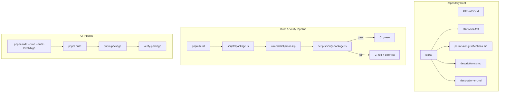

# Design Document: Chrome Store Publishing

## Overview

This design covers the artifacts, scripts, and CI integration needed to prepare the Almedalsstjärnan Chrome extension for publication on the Chrome Web Store. The scope is limited to repository-level documentation, a build verification script, dependency remediation, and CI pipeline updates — no runtime code changes to the extension itself.

The deliverables fall into two categories:

1. **Static artifacts** — Markdown files and directory structure (`PRIVACY.md`, `store/` directory with listing docs, permission justifications, single-purpose statement).
2. **Automated verification** — A verify script that inspects the packaged `.zip` contents and a CI step that enforces clean build output and zero high-severity vulnerabilities.

## Architecture



The verify script runs as a post-packaging step. It reads the zip file's entry list (no extraction needed), applies deny-list and require-list checks, and exits non-zero on violations.

## Components and Interfaces

### 1. Privacy Policy (`PRIVACY.md`)

A Markdown document at repository root with the following sections:
- Extension name and purpose
- Data stored (chrome.storage.local only, on-device)
- Data NOT collected (no analytics, no external transmission)
- Last updated date

No code interface — this is a static document.

### 2. Store Directory (`store/`)

A directory at repository root containing:

| File | Purpose |
|------|---------|
| `README.md` | Documents required/recommended Chrome Web Store assets, screenshot specs, category |
| `permission-justifications.md` | Per-permission justifications + single-purpose statement |
| `description-sv.md` | Swedish store description |
| `description-en.md` | English store description |

### 3. Verify Script (`scripts/verify-package.ts`)

```typescript
interface VerifyResult {
  readonly valid: boolean;
  readonly disallowedFiles: readonly string[];
  readonly missingRequired: readonly string[];
}

// Pure logic function — testable independently of I/O
function verifyEntries(entries: readonly string[]): VerifyResult;

// Script entry point — reads zip, calls verifyEntries, prints results
function main(): void;
```

**Key design decisions:**

- **Pure core + thin I/O shell**: The `verifyEntries` function is a pure function that takes an array of file paths and returns a result. This separation allows property-based testing of the verification logic without needing actual zip files.
- **Pattern-based deny list**: Uses glob/regex patterns rather than exact paths for flexibility (e.g., `**/*.map`, `**/.kiro/**`, `**/tests/**`, `**/node_modules/**`).
- **Explicit require list**: Checks for presence of `manifest.json`, at least one `.js` file, at least one `.html` file, `_locales/` directory entries, and `icons/` directory entries.
- **Runs with `tsx`**: Consistent with existing `scripts/package.ts`.

### 4. CI Pipeline Updates

Add two steps to `.github/workflows/ci.yml`:

1. **Security audit** (already exists, change `|| true` to strict exit): `pnpm audit --prod --audit-level=high`
2. **Verify package**: Run `pnpm package` then `tsx scripts/verify-package.ts`

## Data Models

### VerifyResult

```typescript
interface VerifyResult {
  /** Whether the build output passes all checks */
  readonly valid: boolean;
  /** Paths in the zip that should not be present */
  readonly disallowedFiles: readonly string[];
  /** Required patterns that had no matching entries */
  readonly missingRequired: readonly string[];
}
```

### Deny Patterns (constants)

```typescript
const DENY_PATTERNS = [
  /\.map$/,           // Source maps
  /^\.kiro\//,        // Kiro spec directory
  /(?:^|\/)tests?\//,  // Test directories
  /^node_modules\//,  // Node modules
] as const;
```

### Required Patterns (constants)

```typescript
const REQUIRED_CHECKS = [
  { pattern: /manifest\.json$/, label: 'manifest.json' },
  { pattern: /\.js$/, label: 'compiled JavaScript files' },
  { pattern: /\.html$/, label: 'HTML files' },
  { pattern: /^_locales\//, label: '_locales/ directory' },
  { pattern: /^icons\//, label: 'icons/ directory' },
] as const;
```

## Correctness Properties

*A property is a characteristic or behavior that should hold true across all valid executions of a system — essentially, a formal statement about what the system should do. Properties serve as the bridge between human-readable specifications and machine-verifiable correctness guarantees.*

The verify script's `verifyEntries` function is a pure function with clear input/output behavior, making it well-suited for property-based testing. The documentation requirements (1–4) are static file checks best validated with example-based tests, and the dependency resolution (Requirement 5) is an integration concern tested by CI tooling.

### Property 1: Deny-list completeness

*For any* list of file entries where one or more entries match a deny pattern (`.map` suffix, `.kiro/` prefix, `tests/` or `test/` directory, `node_modules/` prefix), `verifyEntries` SHALL include every matching entry in `disallowedFiles` and set `valid` to `false`.

**Validates: Requirements 6.1, 6.2, 6.3, 6.4, 6.7**

### Property 2: Require-list accuracy

*For any* list of file entries, `verifyEntries` SHALL report in `missingRequired` exactly those required categories (manifest.json, JavaScript files, HTML files, `_locales/` entries, `icons/` entries) that have no matching entry in the list — no false positives and no false negatives.

**Validates: Requirements 6.5, 6.8**

### Property 3: Clean build passes verification

*For any* list of file entries that contains at least one entry matching each required category AND contains zero entries matching any deny pattern, `verifyEntries` SHALL return `valid: true` with empty `disallowedFiles` and empty `missingRequired`.

**Validates: Requirements 6.1, 6.2, 6.3, 6.4, 6.5**

## Error Handling

### Verify Script Errors

| Scenario | Handling |
|----------|----------|
| Zip file does not exist | Print error message, exit code 1 |
| Zip file is corrupt / unreadable | Print error message, exit code 1 |
| Disallowed files detected | Print list of violations, exit code 1 |
| Required files missing | Print list of missing categories, exit code 1 |
| Both disallowed and missing | Print both lists, exit code 1 |
| All checks pass | Print success summary, exit code 0 |

### Dependency Audit Errors

| Scenario | Handling |
|----------|----------|
| `pnpm audit` finds high/critical vulnerabilities | CI step fails, blocks merge |
| Network error during audit | CI step fails (retry handled by CI runner) |

### CI Pipeline Errors

The verify step runs after the build+package step. If the build itself fails, the verify step is skipped (standard CI job sequencing).

## Testing Strategy

### Property-Based Tests (fast-check)

The `verifyEntries` pure function is tested with property-based tests using fast-check (already a project dev dependency).

- **Library**: fast-check (v4.7.0, already in devDependencies)
- **Minimum iterations**: 100 per property
- **Test file**: `tests/property/verify-package.property.test.ts`
- **Custom arbitraries**: Generate random file path lists with controllable presence of deny-pattern and required-pattern entries

Each property test is tagged:
```
// Feature: chrome-store-publishing, Property 1: Deny-list completeness
// Feature: chrome-store-publishing, Property 2: Require-list accuracy
// Feature: chrome-store-publishing, Property 3: Clean build passes verification
```

### Unit Tests (Vitest)

- **File**: `tests/unit/verify-package.test.ts`
- Test specific examples for each deny pattern (`.map`, `.kiro/`, `tests/`, `node_modules/`)
- Test edge cases: empty entry list, entries with similar-but-not-matching names (e.g., `mapping.js` should not be flagged, `test-utils.js` in a non-test directory should not be flagged)
- Test the `main()` function with a mocked zip reader (integration between I/O and pure logic)

### Integration / CI Tests

- `pnpm audit --prod --audit-level=high` runs in CI and must exit 0
- `pnpm package` followed by `tsx scripts/verify-package.ts` runs in CI
- Build and unit test steps must pass (existing CI already covers this)

### What Is NOT Tested with PBT

- Static documentation files (Requirements 1–4): Verified by example-based tests checking file existence and content
- Dependency resolution (Requirement 5): Verified by CI running `pnpm audit`
- CI configuration itself: Verified by successful pipeline runs

