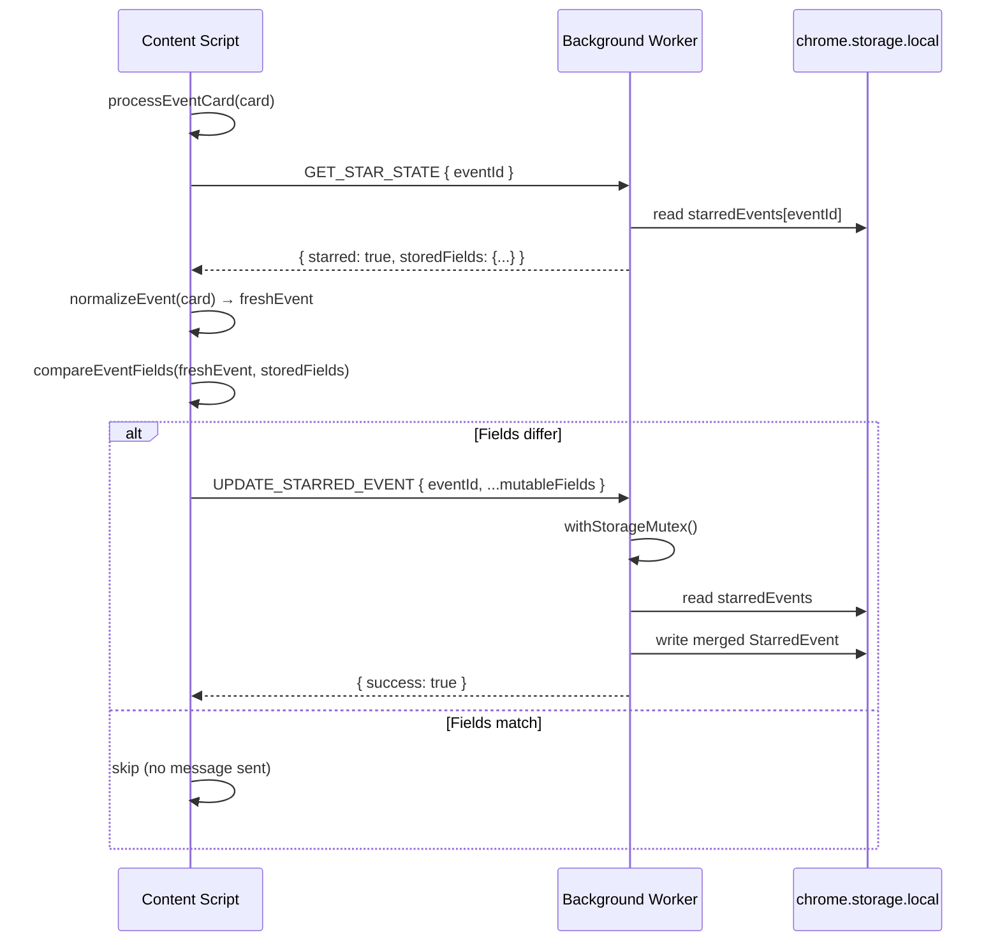

# Design Document: Event Data Refresh

## Overview

This feature introduces a silent, non-disruptive mechanism that detects when starred event data has changed on almedalsveckan.info and updates `chrome.storage.local` while preserving the user's original `starredAt` timestamp. The refresh operates as a piggyback on the existing content script card processing flow — no new network requests, no polling, no user-visible UI changes.

**Core principle**: When the content script processes an Event_Card that is already starred, it re-normalizes the DOM data and compares it field-by-field against the stored snapshot. If any mutable field differs, it sends a single `UPDATE_STARRED_EVENT` message to the background worker, which performs a surgical field-level update under the existing storage mutex.

**Key constraints**:
- Zero impact on star/unstar user interactions (refresh yields to active operations)
- No additional network requests — uses DOM data already present on the page
- Preserves `starredAt` and `starred` fields unconditionally
- Pure comparison logic module suitable for property-based testing
- Asynchronous execution that never blocks the main thread beyond 50ms per card

## Architecture



The refresh check is inserted **after** the star button has been injected and the initial star state displayed, ensuring non-interference with the primary UX flow.

## Components and Interfaces

### 1. Comparison Logic Module (`src/core/event-field-comparator.ts`)

A pure function module with no side effects, no dependencies on browser APIs, and full property-based testability.

```typescript
// src/core/event-field-comparator.ts

import type { NormalizedEvent } from '#core/types';

/** The 9 mutable fields that may change over time on the website */
export const MUTABLE_FIELDS = [
  'title',
  'organiser',
  'startDateTime',
  'endDateTime',
  'location',
  'description',
  'topic',
  'sourceUrl',
  'icsDataUri',
] as const;

export type MutableFieldName = (typeof MUTABLE_FIELDS)[number];

/** Subset of NormalizedEvent containing only the mutable fields */
export type MutableFields = Pick<NormalizedEvent, MutableFieldName>;

/** Result of comparing two sets of mutable fields */
export interface ComparisonResult {
  readonly hasChanges: boolean;
  readonly changedFields: readonly MutableFieldName[];
}

/**
 * Normalizes a single field value for comparison:
 * - Trims leading/trailing whitespace
 * - Converts empty or whitespace-only strings to null
 */
export function normalizeFieldValue(value: string | null): string | null;

/**
 * Compares the mutable fields of a fresh NormalizedEvent against stored fields.
 * Returns which fields (if any) have changed.
 *
 * Both inputs are normalized before comparison: whitespace-trimmed,
 * empty/whitespace-only strings converted to null, then strict equality.
 */
export function compareEventFields(
  fresh: MutableFields,
  stored: MutableFields,
): ComparisonResult;
```

### 2. Enhanced GET_STAR_STATE Response

The existing `GET_STAR_STATE` handler returns `boolean`. It will be enhanced to return stored mutable fields alongside the boolean, enabling the content script to compare without a second round-trip.

```typescript
// New response type for GET_STAR_STATE
export interface GetStarStateData {
  readonly starred: boolean;
  readonly storedFields: MutableFields | null; // null when not starred
}

// Response changes from MessageResponse<boolean> to MessageResponse<GetStarStateData>
export type GetStarStateResponse = MessageResponse<GetStarStateData>;
```

### 3. UPDATE_STARRED_EVENT Message Command

```typescript
// Addition to MessageCommand union
export type MessageCommand = /* ...existing */ | 'UPDATE_STARRED_EVENT';

// New payload type
export interface UpdateStarredEventPayload {
  readonly command: 'UPDATE_STARRED_EVENT';
  readonly eventId: EventId;
  readonly title: string;
  readonly organiser: string | null;
  readonly startDateTime: string;
  readonly endDateTime: string | null;
  readonly location: string | null;
  readonly description: string | null;
  readonly topic: string | null;
  readonly sourceUrl: string | null;
  readonly icsDataUri: string | null;
}
```

### 4. Background Worker Handler (`updateStarredEvent`)

```typescript
async function updateStarredEvent(
  adapter: IBrowserApiAdapter,
  payload: UpdateStarredEventPayload,
): Promise<MessageResponse<void>> {
  return withStorageMutex(async () => {
    const result = await adapter.storageLocalGet(['starredEvents']);
    const starredEvents = result.starredEvents ?? {};

    const existing = starredEvents[payload.eventId];
    if (!existing) {
      // Event not starred — no-op, return success
      return { success: true, data: undefined };
    }

    // Merge: overwrite mutable fields, preserve id, starred, starredAt
    const updated: StarredEvent = {
      id: existing.id,
      starred: existing.starred,
      starredAt: existing.starredAt,
      title: payload.title,
      organiser: payload.organiser,
      startDateTime: payload.startDateTime,
      endDateTime: payload.endDateTime,
      location: payload.location,
      description: payload.description,
      topic: payload.topic,
      sourceUrl: payload.sourceUrl,
      icsDataUri: payload.icsDataUri,
    };

    await adapter.storageLocalSet({
      starredEvents: { ...starredEvents, [payload.eventId]: updated },
    });

    return { success: true, data: undefined };
  });
}
```

### 5. Content Script Integration Point

The refresh logic is added inside `processEventCard()`, after the star button is injected and initialized:

```typescript
// Inside processEventCard, after card.setAttribute('data-almedals-planner-initialized', '1')

// --- Refresh logic (non-blocking, fire-and-forget) ---
if (starStateData.starred && starStateData.storedFields) {
  void refreshStarredEventData(event, starStateData.storedFields, eventId, adapter);
}
```

The `refreshStarredEventData` helper:
```typescript
async function refreshStarredEventData(
  freshEvent: NormalizedEvent,
  storedFields: MutableFields,
  eventId: EventId,
  adapter: IBrowserApiAdapter,
): Promise<void> {
  try {
    const comparison = compareEventFields(freshEvent, storedFields);
    if (!comparison.hasChanges) return;

    await adapter.sendMessage({
      command: 'UPDATE_STARRED_EVENT',
      eventId,
      title: freshEvent.title,
      organiser: freshEvent.organiser,
      startDateTime: freshEvent.startDateTime,
      endDateTime: freshEvent.endDateTime,
      location: freshEvent.location,
      description: freshEvent.description,
      topic: freshEvent.topic,
      sourceUrl: freshEvent.sourceUrl,
      icsDataUri: freshEvent.icsDataUri,
    });
  } catch {
    console.warn('[Almedalsstjärnan] Refresh comparison failed for event:', eventId);
  }
}
```

## Data Models

### Storage Impact

No new storage keys are introduced. The existing `starredEvents` record in `chrome.storage.local` is updated in-place. The `StarredEvent` interface is unchanged — the update merely overwrites the mutable field values within an existing record.

### Type Changes Summary

| Type | Change |
|------|--------|
| `MessageCommand` | Add `'UPDATE_STARRED_EVENT'` to the union |
| `MessagePayload` | Add `UpdateStarredEventPayload` variant |
| `GetStarStateResponse` | Change data from `boolean` to `GetStarStateData` |
| New: `GetStarStateData` | `{ starred: boolean; storedFields: MutableFields \| null }` |
| New: `UpdateStarredEventPayload` | `{ command, eventId, ...9 mutable fields }` |
| New: `MutableFields` | `Pick<NormalizedEvent, MutableFieldName>` |
| New: `MutableFieldName` | Union of 9 field name literals |
| New: `ComparisonResult` | `{ hasChanges: boolean; changedFields: MutableFieldName[] }` |

### Backward Compatibility

The `GET_STAR_STATE` response type change from `boolean` to `GetStarStateData` is a breaking change to the internal message protocol. All consumers of `GET_STAR_STATE` must be updated:
- `content-script.ts` — primary consumer, updated as part of this feature
- `star-button.ts` — uses the response for initial state; needs to read `.starred` from the new shape
- Any UI code calling `GET_STAR_STATE` directly

Since this is an internal extension protocol (not a public API), all consumers are within the codebase and will be updated atomically.

## Correctness Properties

*A property is a characteristic or behavior that should hold true across all valid executions of a system — essentially, a formal statement about what the system should do. Properties serve as the bridge between human-readable specifications and machine-verifiable correctness guarantees.*

### Property 1: Field normalization converts whitespace-only to null and trims

*For any* string value (including empty strings, whitespace-only strings, and strings with leading/trailing whitespace), `normalizeFieldValue` SHALL return `null` for empty or whitespace-only inputs, and a trimmed string otherwise. For any `null` input, it SHALL return `null`.

**Validates: Requirements 5.1**

### Property 2: Self-comparison yields no changes (idempotence)

*For any* valid `MutableFields` object, comparing it against itself (or a structurally identical copy) SHALL produce `{ hasChanges: false, changedFields: [] }`.

**Validates: Requirements 5.4, 5.5**

### Property 3: Comparison detects real differences (sensitivity)

*For any* two `MutableFields` objects that differ in at least one field after normalization, `compareEventFields` SHALL return `{ hasChanges: true }` with `changedFields` containing at least the differing field name.

**Validates: Requirements 5.3, 5.6**

### Property 4: Update preserves immutable fields

*For any* `StarredEvent` in storage and *any* valid `UpdateStarredEventPayload`, after the background worker processes the update, the resulting stored event SHALL have identical `id`, `starred`, and `starredAt` values to the original.

**Validates: Requirements 2.1, 2.2, 2.3**

### Property 5: GET_STAR_STATE returns stored mutable fields for starred events

*For any* `StarredEvent` stored in `chrome.storage.local`, sending a `GET_STAR_STATE` message with its event id SHALL return a response where `storedFields` contains each of the 9 mutable field values matching the stored event exactly.

**Validates: Requirements 4.1**

### Property 6: No update message for non-starred events

*For any* `NormalizedEvent` whose id does not exist in the starred events storage, the refresh mechanism SHALL never send an `UPDATE_STARRED_EVENT` message, regardless of what field values are present in the DOM.

**Validates: Requirements 6.4**

### Property 7: Concurrent updates via mutex preserve all writes

*For any* sequence of `UPDATE_STARRED_EVENT` messages targeting different event ids processed concurrently through the storage mutex, each event's final stored state SHALL reflect its most recent update, and no writes SHALL be lost.

**Validates: Requirements 3.3**

## Error Handling

| Scenario | Handler | Behaviour |
|----------|---------|-----------|
| `normalizeEvent` returns `ok: false` for a starred card | Content Script | Log warning, skip refresh, continue with star button injection |
| `GET_STAR_STATE` returns error or adapter throws | Content Script | Log warning, skip refresh, star button uses `false` as default |
| `compareEventFields` throws (should not happen for pure function) | Content Script | Caught by outer try/catch, log warning, skip refresh |
| `UPDATE_STARRED_EVENT` returns `{ success: false }` | Content Script | Log warning, retain current star button state unchanged |
| `adapter.sendMessage` throws during update | Content Script | Caught by try/catch in `refreshStarredEventData`, log warning |
| `storageLocalGet` throws inside update handler | Background Worker | Caught by `handleMessage` try/catch, returns `MessageResponseError` |
| `storageLocalSet` throws inside update handler | Background Worker | Caught by `handleMessage` try/catch, returns `MessageResponseError` |
| `UPDATE_STARRED_EVENT` for non-existent event id | Background Worker | No-op, return `{ success: true, data: undefined }` |
| Star/unstar in progress during refresh | Content Script | Skip/discard pending refresh for that event |

**Design principle**: The refresh mechanism is entirely fire-and-forget from the user's perspective. Any failure at any stage is silently logged and does not affect the star button UI, the star/unstar flow, or page performance.

## Testing Strategy

### Property-Based Tests (fast-check)

Each correctness property is implemented as a property-based test with minimum 100 iterations using the `fast-check` library. Test files follow the naming convention `{name}.property.test.ts` in `tests/property/`.

| Property | Test File | Key Generators |
|----------|-----------|----------------|
| P1: Field normalization | `field-normalization.property.test.ts` | `fc.string()`, `fc.constantFrom(null)`, whitespace strings |
| P2: Self-comparison idempotence | `comparison-idempotence.property.test.ts` | `normalizedEventArb` from event-generators |
| P3: Comparison sensitivity | `comparison-sensitivity.property.test.ts` | Pairs of `MutableFields` with at least one field mutated |
| P4: Update preserves immutable fields | `update-preserves-immutable.property.test.ts` | `starredEventArb`, random mutable field values |
| P5: GET_STAR_STATE returns stored fields | `get-star-state-fields.property.test.ts` | `starredEventArb`, mock adapter |
| P6: No update for non-starred | `no-update-non-starred.property.test.ts` | `normalizedEventArb`, empty storage |
| P7: Concurrent mutex writes | `mutex-concurrent-writes.property.test.ts` | Arrays of `UpdateStarredEventPayload` |

**Configuration**:
- Minimum 100 iterations per property (`numRuns: 100`)
- Each test tagged with: `// Feature: event-data-refresh, Property {N}: {title}`
- Custom arbitraries extended in `tests/helpers/event-generators.ts`

### Unit Tests (Vitest)

| Module | Coverage Focus |
|--------|---------------|
| `event-field-comparator.ts` | Edge cases: all-null fields, mixed null/non-null, trailing whitespace |
| `background.ts` (update handler) | Success path, non-existent event, storage error, response shape |
| `background.ts` (enhanced GET_STAR_STATE) | Starred with fields, not-starred returns null |
| `content-script.ts` (refresh integration) | Star button injected first, refresh skipped on failure, no update when not starred |

### Integration Tests

- E2E Playwright test verifying that after changing event data in the fixture HTML and reloading, the popup/stars page reflects updated data.

### What is NOT Property-Tested

- DOM manipulation (star button injection ordering) — unit tests with mock DOM
- MutationObserver wiring — integration test
- Performance constraints (50ms limit) — code review + async pattern verification
- Cross-tab storage change propagation — existing E2E coverage

