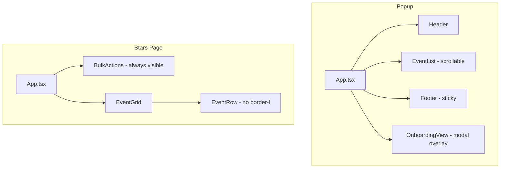

# Design Document: Popup UX Improvements

## Overview

This design covers four targeted UX improvements to the Almedalsstjärnan browser extension:

1. **Popup scroll containment** — Make the footer sticky and constrain scrolling to the event list only
2. **Always-visible bulk actions** — Show the BulkActions bar at all times on the Stars Page, with disabled state when nothing is selected
3. **Remove grid divider** — Remove the inconsistent `border-l` on the date/time column in EventRow
4. **Onboarding as modal overlay** — Present OnboardingView as a fixed overlay so it's visible regardless of scroll position

All changes are CSS/layout and minor component logic adjustments. No new data models, APIs, or storage changes are required.

## Architecture

The changes are isolated to the UI layer (`src/ui/popup/` and `src/ui/stars/`). No core logic, background script, or content script modifications are needed.



## Components and Interfaces

### 1. Popup Layout (`src/ui/popup/App.tsx`)

**Current state:** The popup is a flex column with `min-h-[480px]`. The footer flows naturally after the event list, meaning it scrolls off-screen when many events are present.

**Target state:**
- Root container: `min-h-[560px]` with `h-[560px]` to fix the popup height and `flex flex-col overflow-hidden`
- Header: remains at the top (flex-shrink-0)
- Event list area: `flex-1 overflow-hidden` — the EventList component already has `overflow-y-auto flex-1` on its `<ul>`
- Footer: `flex-shrink-0` — stays pinned at the bottom of the flex container

**Key classes on root:**
```
w-[360px] h-[560px] min-h-[560px] flex flex-col overflow-hidden bg-white
```

The `overflow-hidden` on the root prevents the entire popup from scrolling. The `flex-1 overflow-y-auto` on the EventList's `<ul>` makes it the sole scrollable region.

### 2. OnboardingView as Modal Overlay (`src/ui/popup/components/OnboardingView.tsx`)

**Current state:** Rendered inline between header and event list with `mx-4 mt-3 mb-2` classes.

**Target state:** Rendered as a fixed overlay with backdrop, centered in the popup viewport.

**Structure:**
```tsx
<div className="fixed inset-0 z-50 flex items-center justify-center bg-black/40"
     role="dialog" aria-modal="true" aria-labelledby="onboarding-title">
  <section className="mx-4 p-4 bg-blue-50 border border-blue-200 rounded-lg max-h-[90%] overflow-y-auto">
    {/* existing content */}
  </section>
</div>
```

**Focus trapping:** On mount, focus moves to the first focusable element inside the overlay. A `keydown` listener on the overlay container traps Tab/Shift+Tab within the modal's focusable elements. On dismiss, focus returns to the Help_Link button.

**Implementation approach:**
- Add a `useEffect` that captures focusable elements within the dialog on mount
- On Tab at last element → focus first element; on Shift+Tab at first element → focus last element
- On Escape key → call `onDismiss`
- Store a ref to the trigger element and restore focus on unmount/dismiss

### 3. BulkActions Always Visible (`src/ui/stars/components/BulkActions.tsx`)

**Current state:** Returns `null` when `selectedCount === 0`.

**Target state:** Always renders the toolbar. When `selectedCount === 0`:
- The count displays "0 / {totalCount}"
- The "unstar selected" and "export selected" buttons have `disabled` attribute and reduced opacity (`opacity-50 cursor-not-allowed`)
- The "select all / clear" button remains enabled (so users can select all)

**Interface change:** No prop changes needed — the existing props already provide `selectedCount` and `totalCount`.

### 4. Remove Grid Divider (`src/ui/stars/components/EventRow.tsx`)

**Current state:** The date/time `<td>` conditionally applies `border-l-2 border-l-slate-300` when `isConflicting === true`.

**Target state:** Remove the conditional `border-l-2 border-l-slate-300` class entirely. The conflict indicator (dot + tooltip) remains unchanged.

**Change:**
```tsx
// Before
<td className={`whitespace-nowrap px-3 py-2 text-sm text-gray-600${isConflicting === true ? ' border-l-2 border-l-slate-300' : ''}`}>

// After
<td className="whitespace-nowrap px-3 py-2 text-sm text-gray-600">
```

## Data Models

No data model changes. All improvements are purely presentational.

## Correctness Properties

*A property is a characteristic or behavior that should hold true across all valid executions of a system — essentially, a formal statement about what the system should do. Properties serve as the bridge between human-readable specifications and machine-verifiable correctness guarantees.*

### Property 1: BulkActions always renders with correct button state

*For any* `selectedCount` (0 to totalCount) and any `totalCount` ≥ 0, the BulkActions component SHALL render a non-null element, and the "unstar selected" and "export selected" buttons SHALL be disabled if and only if `selectedCount === 0`.

**Validates: Requirements 2.1, 2.2, 2.3**

### Property 2: BulkActions always displays counts

*For any* `selectedCount` and `totalCount`, the rendered BulkActions output SHALL contain both the selectedCount value and the totalCount value as visible text.

**Validates: Requirements 2.4, 2.5**

### Property 3: EventRow date/time column has no conditional border styling

*For any* event and any conflict state (true or false), the date/time column `<td>` in EventRow SHALL have identical border-related class names — specifically, no `border-l` variant shall be present.

**Validates: Requirements 3.1, 3.2, 3.3**

## Error Handling

These are purely visual/layout changes with no new error paths. Existing error handling in the popup and stars page remains unchanged.

- If the OnboardingView modal fails to trap focus (e.g., no focusable elements found), it should degrade gracefully by not trapping focus rather than throwing.
- The BulkActions disabled state uses native HTML `disabled` attribute, which inherently prevents click handlers from firing.

## Testing Strategy

### Property-Based Tests (fast-check)

Property-based testing is applicable for the BulkActions and EventRow changes since they involve pure rendering logic that varies meaningfully with input.

**Library:** fast-check  
**Minimum iterations:** 100  
**Tag format:** `// Feature: popup-ux-improvements, Property {N}: {title}`

Tests to implement:

1. **BulkActions render and button state** — Generate arbitrary `selectedCount` (0..totalCount) and `totalCount` (0..100). Verify the component always renders, and buttons are disabled iff selectedCount === 0.
2. **BulkActions count display** — Generate arbitrary selectedCount and totalCount. Verify both numbers appear in the rendered text.
3. **EventRow no conditional border** — Generate arbitrary events with `isConflicting` true/false. Verify the date/time td never contains `border-l` classes.

### Unit Tests (Vitest)

- **Popup layout:** Verify root container has correct classes (`h-[560px]`, `min-h-[560px]`, `overflow-hidden`). Verify footer has `flex-shrink-0`.
- **OnboardingView modal:** Verify overlay renders with `fixed inset-0 z-50`, `role="dialog"`, `aria-modal="true"`. Verify dismiss button closes the overlay. Verify Escape key closes the overlay.
- **Focus trapping:** Verify Tab cycles within the modal. Verify Shift+Tab reverse-cycles. Verify focus returns to trigger on dismiss.
- **BulkActions disabled state:** Verify buttons have `disabled` attribute when selectedCount is 0. Verify buttons are enabled when selectedCount > 0.
- **EventRow border removal:** Verify no `border-l` class on date/time td for both conflicting and non-conflicting events.

### E2E Tests

No new E2E tests needed — these are visual/layout changes that are best verified by unit and property tests. Existing E2E tests for star/unstar flow will continue to pass since no behavioral changes are made.
