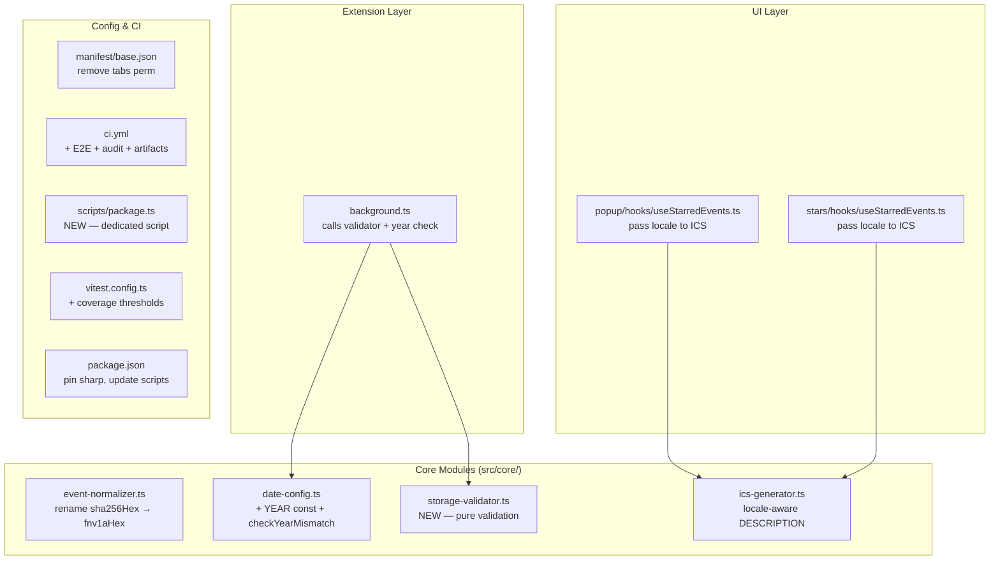

# Design Document: Production Readiness

## Overview

This design covers the technical changes required to harden the Almedalsstjärnan extension for public release. The scope includes:

1. **Code correctness** — renaming a misleadingly-named hash function, adding year-awareness to date configuration
2. **Security** — removing overly broad `tabs` permission, adding storage schema validation, CI security auditing, pinning dependencies
3. **Quality enforcement** — coverage thresholds, E2E in CI, Playwright artifact upload
4. **Localization** — threading locale through ICS generation for source labels
5. **Developer experience** — dedicated packaging script, README dev instructions

All changes target existing modules and CI configuration. No new UI surfaces are introduced.

## Architecture

The changes touch these layers:



### Design Decisions

| Decision | Rationale |
|---|---|
| Storage validator as a separate `src/core/storage-validator.ts` module | Pure function, easily unit-testable and property-testable in isolation. Follows one-export-per-file convention. |
| `checkYearMismatch` in `date-config.ts` | Co-locates year logic with year data. Keeps the module as the single source of truth for year-specific configuration. |
| Package script in TypeScript (`scripts/package.ts`) | Project already uses TypeScript everywhere. Run via `tsx` (already available via vitest's transitive dep) or `node --import tsx`. Cross-platform via Node.js `fs` and `child_process`. |
| ICS locale parameter already exists but is unused | The `_locale` parameter in `generateICS` is already declared. Design threads it through `buildDescription` to prepend the source label. |
| Security audit runs before build | Fails fast on vulnerable deps, avoids wasting CI minutes building with known-bad dependencies. |

## Components and Interfaces

### Storage Validator (`src/core/storage-validator.ts`)

```typescript
import type { StarredEvent, EventId } from './types';

/**
 * Result of storage validation. Contains only entries that pass
 * all structural checks. Invalid entries are silently filtered.
 */
export interface StorageValidationResult {
  readonly valid: Readonly<Record<EventId, StarredEvent>>;
  readonly invalidKeys: readonly string[];
}

/**
 * Validates the raw `starredEvents` value read from chrome.storage.local.
 *
 * Pure function — no side effects. Logging is the caller's responsibility.
 *
 * @param raw - The raw value from storage (could be anything)
 * @returns StorageValidationResult with valid entries and list of rejected keys
 */
export function validateStarredEvents(
  raw: unknown,
): StorageValidationResult;

/**
 * Validates a single entry against the StarredEvent schema.
 *
 * Checks:
 * - entry is a non-null object
 * - entry.id is a non-empty string matching the provided key
 * - entry.title is a non-empty string
 * - entry.startDateTime is a non-empty string
 * - entry.starred === true
 * - entry.starredAt is a non-empty string
 *
 * @param key - The object key this entry was stored under
 * @param entry - The raw entry value
 * @returns true if the entry is a valid StarredEvent
 */
export function isValidStarredEntry(
  key: string,
  entry: unknown,
): entry is StarredEvent;
```

**Implementation strategy:**
- `validateStarredEvents` first checks that `raw` is a non-null, non-array object (`typeof raw === 'object' && raw !== null && !Array.isArray(raw)`)
- If top-level check fails, return `{ valid: {}, invalidKeys: [] }`
- Iterate `Object.entries(raw)`, apply `isValidStarredEntry` to each
- Accumulate valid entries and rejected keys
- Return both for the caller to log as needed

### `checkYearMismatch` in Date Config (`src/core/date-config.ts`)

```typescript
/** The year these date mappings apply to. */
export const YEAR = 2026 as const;

export interface YearMismatchResult {
  readonly mismatch: boolean;
  readonly expected: number;
  readonly actual: number;
}

/**
 * Compares the current system year against the configured YEAR constant.
 * Returns a discriminated-union result indicating whether there is a mismatch.
 *
 * Called once during service worker initialization to emit a console warning
 * if the extension is running in a different year than configured.
 */
export function checkYearMismatch(): YearMismatchResult;
```

**Implementation:** Uses `new Date().getFullYear()` to get the system year. Returns `{ mismatch: actual !== YEAR, expected: YEAR, actual }`.

### ICS Generator Locale Threading

The existing `generateICS` function already accepts a `locale` parameter but ignores it (parameter named `_locale`). The design threads it into description building:

```typescript
// In ics-generator.ts — updated buildDescription signature
function buildDescription(
  description: string | null,
  sourceUrl: string | null,
  locale: 'sv' | 'en',
): string | null;
```

**Logic:**
- If `description` is null and `sourceUrl` is null → return null
- Build parts array:
  - If `description` is non-null, include it
  - If `sourceUrl` is non-null, append `"\n{label} {sourceUrl}"` where `label` is `"Källa:"` for `'sv'` or `"Source:"` for `'en'`
- Join parts with `\n` and return

The source label values are hardcoded in the generator (not pulled from `locale-messages.ts`) since they are ICS content strings, not UI strings, and the ICS generator should remain free of adapter dependencies.

### CI Pipeline Additions

The updated `.github/workflows/ci.yml` adds three concerns:

1. **Security audit** — new step after install, before lint:
   ```yaml
   - name: Security audit
     run: pnpm audit --prod --audit-level=high
   ```

2. **E2E tests** — new steps after build:
   ```yaml
   - name: Install Playwright browsers
     run: npx playwright install chromium

   - name: E2E tests
     run: pnpm run test:e2e
   ```

3. **Artifact upload on E2E failure**:
   ```yaml
   - name: Upload Playwright results
     uses: actions/upload-artifact@v4
     if: failure()
     with:
       name: playwright-results
       path: test-results/
       retention-days: 7
   ```

### Package Script (`scripts/package.ts`)

Cross-platform TypeScript script using Node.js built-in modules:

```typescript
// scripts/package.ts
import { execSync } from 'node:child_process';
import { existsSync, unlinkSync } from 'node:fs';
import { resolve } from 'node:path';

const ROOT = resolve(import.meta.dirname, '..');
const ZIP_PATH = resolve(ROOT, 'almedalsstjarnan.zip');
const DIST_PATH = resolve(ROOT, 'dist');

// 1. Remove existing zip
if (existsSync(ZIP_PATH)) {
  unlinkSync(ZIP_PATH);
}

// 2. Create zip from dist/
// Uses platform-appropriate command
if (process.platform === 'win32') {
  execSync(
    `powershell Compress-Archive -Path "${DIST_PATH}\\*" -DestinationPath "${ZIP_PATH}" -Force`,
    { stdio: 'inherit' },
  );
} else {
  execSync(`cd "${DIST_PATH}" && zip -r "${ZIP_PATH}" .`, {
    stdio: 'inherit',
  });
}
```

The `package` script in `package.json` becomes:
```json
"package": "pnpm run build && tsx scripts/package.ts"
```

This uses `tsx` which is already available as a transitive dependency. If not directly accessible, we add it as a dev dependency.

## Data Models

### YearMismatchResult

```typescript
export interface YearMismatchResult {
  readonly mismatch: boolean;
  readonly expected: number;
  readonly actual: number;
}
```

### StorageValidationResult

```typescript
export interface StorageValidationResult {
  readonly valid: Readonly<Record<EventId, StarredEvent>>;
  readonly invalidKeys: readonly string[];
}
```

### Updated manifest permissions

```json
{
  "permissions": ["storage", "downloads"]
}
```

The `tabs` permission is removed. `chrome.tabs.create` for extension-internal URLs (`chrome-extension://...`) does not require the `tabs` permission — it only requires it for reading tab URLs/titles.

## Correctness Properties

*A property is a characteristic or behavior that should hold true across all valid executions of a system — essentially, a formal statement about what the system should do. Properties serve as the bridge between human-readable specifications and machine-verifiable correctness guarantees.*

### Property 1: fnv1aHex deterministic consistency

*For any* input string, calling `fnv1aHex` SHALL produce a deterministic hex string output, and calling it twice with the same input SHALL produce identical results.

**Validates: Requirements 1.3**

### Property 2: Storage validator rejects invalid top-level values

*For any* value that is not a non-null, non-array object (including null, undefined, arrays, strings, numbers, and booleans), the storage validator SHALL return an empty valid record.

**Validates: Requirements 3.1, 3.2**

### Property 3: Storage validator filters malformed entries and preserves valid entries unchanged

*For any* object containing a mix of valid `StarredEvent` entries and malformed entries (missing fields, wrong types, id/key mismatch), the storage validator SHALL return exactly the subset of entries that satisfy all validation checks, with each valid entry identical to the input (round-trip preservation).

**Validates: Requirements 3.3, 3.4, 3.5, 3.6**

### Property 4: ICS locale-aware source label

*For any* set of starred events that have non-null `sourceUrl` fields, and *for any* supported locale, the generated ICS DESCRIPTION field SHALL contain the locale-appropriate source label (`"Källa:"` for `'sv'`, `"Source:"` for `'en'`) followed by the source URL.

**Validates: Requirements 7.1, 7.2**

## Error Handling

| Scenario | Handling |
|---|---|
| Storage contains non-object value for `starredEvents` | Validator returns empty record; background logs `console.warn` with corruption message |
| Individual entry fails validation | Entry excluded from returned record; background logs `console.warn` identifying the key |
| `checkYearMismatch` detects mismatch | Background logs `console.warn` with expected/actual year; extension continues normally |
| `pnpm audit` finds high/critical vulnerability | CI step exits non-zero; workflow fails before build |
| E2E test fails in CI | Playwright exits non-zero; artifacts uploaded; workflow fails |
| Package script: zip command fails | `execSync` throws; script exits non-zero; user sees error in terminal |

No new error types or discriminated unions are introduced beyond `StorageValidationResult`. The validator is intentionally lenient (filter, don't throw) to match the requirement of graceful degradation.

## Testing Strategy

### Unit Tests

| Module | Test File | Coverage |
|---|---|---|
| `storage-validator.ts` | `tests/unit/core/storage-validator.test.ts` | All branches of `validateStarredEvents` and `isValidStarredEntry` |
| `date-config.ts` (checkYearMismatch) | `tests/unit/core/date-config.test.ts` | Match and mismatch scenarios with mocked Date |
| `ics-generator.ts` (locale threading) | `tests/unit/core/ics-generator.test.ts` | Both locales with sourceUrl present/absent |
| `event-normalizer.ts` (rename) | `tests/unit/core/event-normalizer.test.ts` | Verify `fnv1aHex` export produces same output as before |
| `background.ts` (year check + validator integration) | `tests/unit/background/background.test.ts` | Verify checkYearMismatch called, console.warn on mismatch, validator applied |

### Property-Based Tests (fast-check)

Library: **fast-check** (already installed, v4.7.0)
Configuration: minimum 100 iterations per property (`numRuns: 100`)

| Property | Test File | Tag |
|---|---|---|
| Property 1: fnv1aHex consistency | `tests/property/fnv1a-consistency.property.test.ts` | `Feature: production-readiness, Property 1: fnv1aHex deterministic consistency` |
| Property 2: Invalid top-level rejection | `tests/property/storage-validator-toplevel.property.test.ts` | `Feature: production-readiness, Property 2: Storage validator rejects invalid top-level values` |
| Property 3: Entry filtering + round-trip | `tests/property/storage-validator-entries.property.test.ts` | `Feature: production-readiness, Property 3: Storage validator filters malformed entries and preserves valid entries unchanged` |
| Property 4: ICS locale source label | `tests/property/ics-locale-label.property.test.ts` | `Feature: production-readiness, Property 4: ICS locale-aware source label` |

### E2E Tests (Playwright)

Already exist at:
- `tests/e2e/star-unstar.e2e.test.ts` — star/unstar flow
- `tests/e2e/ics-export.e2e.test.ts` — ICS export flow

These will be exercised in CI after the pipeline changes.

### Integration / Smoke Checks

- Manifest permission removal verified by existing manifest-merge property test + manual load
- Coverage thresholds enforced by vitest configuration (fails CI automatically)
- Security audit enforced by CI step
- README content verified by human review

### Test Generators

The existing `tests/helpers/event-generators.ts` provides `starredEventArb` and `normalizedEventArb`. For storage validator tests, additional generators are needed:

- **`malformedEntryArb`** — generates objects that fail one or more validation checks (missing `id`, wrong `starred` value, empty `title`, etc.)
- **`mixedStorageRecordArb`** — generates `Record<string, unknown>` with a mix of valid StarredEvent entries and malformed entries
- **`invalidTopLevelArb`** — generates values that are not valid storage objects (null, arrays, strings, numbers, booleans)

These will be added to `tests/helpers/event-generators.ts`.
