# Design Document

## Overview

This design addresses five independent technical gaps blocking Chrome Web Store publication. Each requirement is a self-contained fix with minimal cross-dependency:

1. **Packaging Script** — Replace platform-dependent shell commands (`Compress-Archive` / `zip` CLI) with a pure Node.js zip implementation using the `archiver`-free approach via Node's built-in `zlib` module and manual zip archive construction, or by leveraging the existing `JSZip`-style logic already present in the project's devDependency chain. Since the project already has no zip library in devDependencies and the constraint forbids adding new ones, we'll implement a minimal zip writer using Node.js `zlib` built-ins.

2. **Privacy Policy Hosting** — Add a GitHub Actions workflow that renders `PRIVACY.md` to HTML and deploys it via GitHub Pages at the required URL.

3. **Bundle Analysis** — Investigate the 230 KB shared chunk, document findings, and apply Vite `manualChunks` / tree-shaking to reduce size where possible.

4. **Stars CSS Fix** — Correct the Vite build so that `stars.html` references `stars.css` (not `popup.css`), ensuring Tailwind classes are applied.

5. **Security Alerts** — Update vulnerable devDependencies and add `pnpm.overrides` for transitive issues.

## Architecture

```mermaid
graph TD
    subgraph "Requirement 1: Packaging"
        A[scripts/package.ts] -->|uses| B[Node.js zlib + fs]
        A -->|produces| C[almedalsstjarnan.zip]
        C -->|validated by| D[scripts/verify-package.ts]
    end

    subgraph "Requirement 2: Privacy Policy"
        E[PRIVACY.md] -->|rendered by| F[GitHub Pages Workflow]
        F -->|deploys to| G[gh-pages branch]
        G -->|serves| H[https://madison-nord.github.io/almedalsstjarnan/PRIVACY]
    end

    subgraph "Requirement 3: Bundle Size"
        I[vite.config.ts] -->|manualChunks| J[Optimized chunks]
        J -->|documented in| K[BUNDLE-ANALYSIS.md]
    end

    subgraph "Requirement 4: Stars CSS"
        L[src/ui/stars/stars.css] -->|built via PostCSS| M[dist/stars.css]
        N[dist/src/ui/stars/stars.html] -->|references| M
    end

    subgraph "Requirement 5: Security"
        O[package.json] -->|updated deps| P[pnpm audit clean]
    end
```



## Components and Interfaces

### Component 1: Cross-Platform Zip Writer (`scripts/package.ts`)

**Current Problem:** The script uses `execFileSync('powershell', [...])` on Windows which fails because `$args` positional parameters aren't passed correctly through `execFileSync`. On Linux it shells out to `zip` CLI.

**Solution:** Replace both platform branches with a single pure-Node.js implementation that creates a valid ZIP file using:
- `node:fs` — `readdirSync`, `readFileSync`, `writeFileSync`, `statSync`
- `node:path` — path manipulation
- `node:zlib` — `deflateRawSync` for file compression
- Manual ZIP binary format construction (local file headers, central directory, EOCD)

**Interface:**

```typescript
// scripts/package.ts - exported for testability

export interface ZipEntry {
  readonly relativePath: string;
  readonly data: Buffer;
}

/**
 * Recursively collects all files under `dirPath` and returns
 * them as ZipEntry objects with paths relative to `dirPath`.
 */
export function collectFiles(dirPath: string): ZipEntry[];

/**
 * Creates a valid ZIP archive buffer from the given entries.
 * Uses DEFLATE compression (method 8) via Node.js zlib.
 */
export function createZipBuffer(entries: readonly ZipEntry[]): Buffer;
```

**Error Handling:**
- If `dist/` doesn't exist, throw an error with a descriptive message and exit code 1.
- If any file read fails, propagate the error with context.

### Component 2: GitHub Pages Workflow (`.github/workflows/pages.yml`)

**Approach:** Use the official `actions/jekyll-build-pages` action (or `actions/configure-pages` + `actions/deploy-pages`) to render Markdown as HTML. GitHub Pages with Jekyll automatically renders `.md` files as HTML.

**Strategy:**
- Create a dedicated `docs/privacy/` directory with only `index.md` (symlinked or copied from `PRIVACY.md`)
- Use `actions/configure-pages` + `actions/upload-pages-artifact` + `actions/deploy-pages`
- Configure the workflow to trigger only on changes to `PRIVACY.md` or the workflow file itself
- Set the source to deploy from the workflow artifact (not the whole repo)

**URL Routing:** To serve at `/almedalsstjarnan/PRIVACY` (without `.html` extension), we'll use a Jekyll config with a permalink or place the file at `PRIVACY/index.md` in the deployed artifact.

### Component 3: Bundle Analysis & Optimization

**Current State:** `dist/conflict-detector.js` is 230 KB. The source `src/core/conflict-detector.ts` is small (~130 lines), so the chunk is large because Vite groups shared dependencies into it as a common chunk for the stars page entry.

**Investigation Approach:**
1. Run `npx vite build --mode production` and analyze the output
2. Use `rollup-plugin-visualizer` (or manual inspection) to identify what modules land in the chunk
3. The chunk is named `conflict-detector.js` because Vite picks the first module's name for the chunk

**Optimization Strategy:**
- Add `build.rollupOptions.output.manualChunks` to the Vite config to control chunk splitting
- Separate React/ReactDOM into their own chunk (they're likely the bulk of 230 KB)
- Keep the actual conflict-detector logic inline with the stars page entry

**Vite Config Change:**
```typescript
build: {
  outDir: 'dist',
  sourcemap: mode === 'development',
  rollupOptions: {
    output: {
      manualChunks(id) {
        if (id.includes('node_modules/react')) {
          return 'vendor-react';
        }
      },
    },
  },
},
```

### Component 4: Stars CSS Build Fix

**Current Problem:** The built `dist/src/ui/stars/stars.html` references `/popup.css` instead of `/stars.css`. The `dist/stars.css` file exists but isn't linked. This happens because `vite-plugin-web-extension` processes the popup entry first and assigns the shared CSS bundle the popup's name.

**Root Cause:** Both `popup.html` and `stars.html` import Tailwind via their own CSS files (`popup.css` and `stars.css`), but Vite deduplicates them into a single CSS chunk. The HTML for stars ends up referencing the popup's CSS filename.

**Fix Options:**
1. **Rename approach**: Accept that Vite produces a single shared CSS file and ensure the stars HTML references it correctly (may require adjusting `additionalInputs` configuration)
2. **Separate CSS entries**: Configure Vite to produce truly separate CSS files per entry
3. **CSS inlining**: Use `?inline` import for one of the CSS files

**Chosen approach:** The simplest fix is to ensure the build produces a `stars.css` that the HTML references. Since both use the same Tailwind config, a single CSS output is fine — we need to ensure the stars HTML's `<link>` tag references the correct file. This may require a post-build script or a Vite plugin configuration adjustment.

If the `vite-plugin-web-extension` is causing the issue by how it handles `additionalInputs`, the fix is to configure the plugin or add explicit CSS handling for the stars entry.

### Component 5: Dependabot Resolution

**Approach:**
1. Run `pnpm audit` to identify all critical/high vulnerabilities
2. For direct devDependencies: bump to patched versions in `package.json`
3. For transitive dependencies: add entries to `pnpm.overrides`
4. Run full CI suite (lint, typecheck, test, build) to confirm nothing breaks
5. Document any unresolvable moderate/low issues in `SECURITY.md` if needed

## Data Models

### ZIP Archive Binary Structure

The packaging script constructs a ZIP file with this structure:

```
┌─────────────────────────┐
│  Local File Header 1    │  (30 bytes + filename + data)
│  Compressed Data 1      │
├─────────────────────────┤
│  Local File Header 2    │
│  Compressed Data 2      │
├─────────────────────────┤
│  ...                    │
├─────────────────────────┤
│  Central Directory      │  (46 bytes per entry + filename)
│  Entry 1                │
│  Entry 2                │
│  ...                    │
├─────────────────────────┤
│  End of Central Dir     │  (22 bytes)
│  (EOCD Record)          │
└─────────────────────────┘
```

Key fields per entry:
- **Compression method**: 8 (DEFLATE) via `zlib.deflateRawSync`
- **CRC-32**: computed via `zlib.crc32` (available in Node 20+)  
- **File paths**: forward-slash separated, relative to `dist/`
- **External attributes**: 0 (regular file)

### GitHub Pages Deployment Structure

```
deployed-artifact/
├── PRIVACY/
│   └── index.html    (rendered from PRIVACY.md by Jekyll)
└── _config.yml       (Jekyll config: baseurl, permalink settings)
```

### Bundle Analysis Document Structure

```markdown
# Bundle Analysis

## Shared Chunk: conflict-detector.js

| Module | Approx. Size (KB) | Purpose |
|--------|-------------------|---------|
| react | XX KB | UI framework |
| react-dom | XX KB | DOM rendering |
| ... | ... | ... |

## Total: XXX KB

## Optimizations Applied / Justification
...
```

## Correctness Properties

*A property is a characteristic or behavior that should hold true across all valid executions of a system — essentially, a formal statement about what the system should do. Properties serve as the bridge between human-readable specifications and machine-verifiable correctness guarantees.*

### Property 1: Zip round-trip preserves file paths

*For any* set of files placed in a directory tree, creating a zip archive using `createZipBuffer(collectFiles(dir))` and then reading the zip entries back SHALL yield exactly the same set of relative file paths — with no wrapper directories prepended, no files omitted, and no extra entries added.

**Validates: Requirements 1.4**

## Error Handling

| Scenario | Component | Behavior |
|----------|-----------|----------|
| `dist/` directory missing | `scripts/package.ts` | Exit with code 1, print "Error: dist/ directory does not exist. Run `pnpm build` first." |
| File read failure during zip | `scripts/package.ts` | Propagate `ENOENT`/`EACCES` error with file path context |
| Zip write failure | `scripts/package.ts` | Propagate write error, exit non-zero |
| GitHub Pages deployment failure | `pages.yml` workflow | Workflow fails visibly in GitHub Actions UI; no fallback needed |
| `pnpm audit` finds unresolvable alert | Security resolution | Document in `SECURITY.md` with advisory ID and reason |
| Build fails after dependency update | Security resolution | Revert the problematic update, try alternative resolution |
| Chunk cannot be reduced below 150 KB | Bundle optimization | Document justification in `BUNDLE-ANALYSIS.md` |

## Testing Strategy

### Property-Based Tests (fast-check)

PBT applies to Requirement 1.4 — the zip creation logic is a pure function (directory → buffer) with a clear round-trip property.

**Configuration:**
- Library: `fast-check` (already in devDependencies)
- Minimum iterations: 100
- Tag format: `// Feature: publish-readiness-fixes, Property 1: Zip round-trip preserves file paths`

**Test file:** `tests/property/zip-roundtrip.property.test.ts`

**Approach:**
- Generate random file trees using fast-check arbitraries (varying depth 0–3, filenames from safe character set, file content as random buffers)
- Write them to a temp directory
- Call `collectFiles()` and `createZipBuffer()`
- Parse the resulting zip buffer (reuse `readZipEntries` logic from `verify-package.ts`)
- Assert the entry set matches the generated file set exactly

### Unit Tests (Vitest)

| Test File | What It Validates |
|-----------|-------------------|
| `tests/unit/scripts/package.test.ts` | `collectFiles` returns correct relative paths; `createZipBuffer` produces valid zip headers; missing dist throws error |
| `tests/unit/scripts/verify-package.test.ts` | (existing) Verify deny/require logic |

### E2E Tests (Playwright)

| Test | What It Validates |
|------|-------------------|
| `tests/e2e/stars-css.e2e.test.ts` | Stars page loads with `display: flex` on root container and `min-height: 100vh` — confirms CSS is applied (Req 4.5) |

### Integration Tests (CI)

| CI Step | What It Validates |
|---------|-------------------|
| `pnpm package` + `verify-package.ts` | Zip is valid on Linux (Req 1.2, 1.5) |
| `pnpm audit --audit-level=high` | No critical/high vulnerabilities (Req 5.1) |
| Bundle size check | Total dist < 500 KB (Req 3.6) |
| Build + lint + typecheck + test | Dependency updates don't break anything (Req 5.4–5.7) |

### Smoke / Manual Tests

| Check | What It Validates |
|-------|-------------------|
| Run `pnpm package` on Windows | Zip produced with exit 0 (Req 1.1) — manual developer check |
| Visit GitHub Pages URL after deploy | HTTP 200 with rendered HTML (Req 2.2) |
| Inspect `BUNDLE-ANALYSIS.md` | Contains module breakdown (Req 3.1) |
