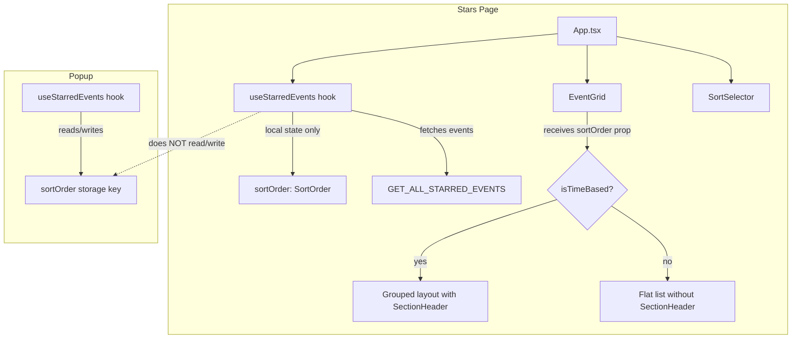

# Design Document: Stars Page Sorting

## Overview

This feature decouples the Stars Page sort state from the shared persisted `sortOrder` storage key and introduces conditional day-grouping based on the active sort order. The Stars Page will use local in-memory state (always starting at `chronological`), never reading or writing the persisted sort key. The EventGrid will conditionally render day-group headers only for time-based sorts, and display a flat list for non-time-based sorts.

The popup remains unchanged — it continues to read/write the persisted `sortOrder` storage key.

### Design Decisions

1. **Local state over storage**: The Stars Page hook will use React `useState` initialized to `DEFAULT_SORT_ORDER` without fetching `GET_SORT_ORDER`. This eliminates the coupling entirely rather than adding ignore-logic.
2. **Pure function for grouping decision**: A new `isTimeBased(order: SortOrder): boolean` utility determines whether to group. This keeps the logic testable and reusable.
3. **EventGrid receives sort order**: Rather than computing grouping internally, EventGrid receives the current `sortOrder` as a prop and decides whether to render grouped or flat layout.
4. **Existing `groupEventsByDate` reused**: The function already works correctly for chronological input. For reverse-chronological, the sorted input naturally produces groups in descending date order since `groupEventsByDate` preserves input order.

## Architecture



### Change Summary

| Component | Change |
|-----------|--------|
| `src/ui/stars/hooks/useStarredEvents.ts` | Remove `GET_SORT_ORDER` fetch, remove `SET_SORT_ORDER` send, remove `sortOrder` from storage listener, initialize sort to `DEFAULT_SORT_ORDER` in-memory only |
| `src/ui/stars/components/EventGrid.tsx` | Accept `sortOrder` prop, conditionally render grouped vs flat layout |
| `src/core/sorter.ts` | Add `isTimeBasedSort(order)` utility (pure function) |
| `src/ui/popup/hooks/useStarredEvents.ts` | No changes |

## Components and Interfaces

### New Utility: `isTimeBasedSort`

Location: `src/core/sorter.ts`

```typescript
/**
 * Returns true if the given sort order is time-based (chronological or reverse-chronological).
 * Time-based sorts produce meaningful day-group headers.
 */
export function isTimeBasedSort(order: SortOrder): boolean {
  return order === 'chronological' || order === 'reverse-chronological';
}
```

### Modified: `useStarredEvents` (Stars Page)

Changes to `src/ui/stars/hooks/useStarredEvents.ts`:

1. **Remove** the `GET_SORT_ORDER` message send from `init()`.
2. **Remove** the `SET_SORT_ORDER` message send from `changeSortOrder()`.
3. **Remove** the `sortOrder` key handling from the `onStorageChanged` listener (keep `starredEvents` handling).
4. **Initialize** `sortOrder` state to `DEFAULT_SORT_ORDER` directly (no async fetch).
5. `changeSortOrder` becomes a pure local state update: `setSortOrder(order)` + re-sort events.

The hook's public interface (`UseStarredEventsResult`) remains unchanged — consumers still get `sortOrder` and `changeSortOrder`.

### Modified: `EventGrid`

Changes to `src/ui/stars/components/EventGrid.tsx`:

1. **Add** `sortOrder` prop to `EventGridProps`.
2. **Conditionally** call `groupEventsByDate` only when `isTimeBasedSort(sortOrder)` is true.
3. **When not time-based**: render events directly as `EventRow` elements without `SectionHeader` wrappers.
4. **Always** render the `<thead>` with column headers regardless of sort order (Requirement 2.5).

```typescript
export interface EventGridProps {
  readonly events: readonly StarredEvent[];
  readonly sortOrder: SortOrder;  // NEW
  readonly onUnstar: (eventId: string) => void;
  readonly adapter: IBrowserApiAdapter;
  readonly conflictingIds?: ReadonlySet<string>;
  readonly conflictTitlesMap?: ReadonlyMap<string, readonly string[]>;
  readonly selectedIds?: ReadonlySet<string>;
  readonly onToggleSelection?: (eventId: string) => void;
  readonly onSelectAll?: () => void;
  readonly allSelected?: boolean;
}
```

### Modified: `App.tsx` (Stars Page)

Pass `sortOrder` to `EventGrid`:

```tsx
<EventGrid
  events={filteredEvents}
  sortOrder={sortOrder}
  onUnstar={unstarEvent}
  adapter={localizedAdapter}
  // ... other props
/>
```

## Data Models

No new data models are introduced. The existing `SortOrder` type and `StarredEvent` interface remain unchanged.

The key behavioral change is that the Stars Page `sortOrder` is no longer persisted — it lives only in React component state and resets to `'chronological'` on every page load.


## Correctness Properties

*A property is a characteristic or behavior that should hold true across all valid executions of a system — essentially, a formal statement about what the system should do. Properties serve as the bridge between human-readable specifications and machine-verifiable correctness guarantees.*

### Property 1: Stars Page initializes to chronological

*For any* stored sort order value in the `sortOrder` storage key (including absent/invalid values), the Stars Page `useStarredEvents` hook SHALL initialize its sort order state to `'chronological'` without reading the stored value.

**Validates: Requirements 1.1, 1.5**

### Property 2: Stars Page sort change never persists

*For any* sort order value, when `changeSortOrder` is called on the Stars Page hook, the adapter SHALL NOT receive a `SET_SORT_ORDER` message and the `sortOrder` storage key SHALL remain unchanged.

**Validates: Requirements 1.2**

### Property 3: Stars Page ignores external sort order changes

*For any* current Stars Page sort order and any external storage change to the `sortOrder` key, the Stars Page hook's sort order state SHALL remain equal to its value before the storage change.

**Validates: Requirements 1.4**

### Property 4: Popup sort change always persists

*For any* sort order value, when `changeSortOrder` is called on the Popup hook, the adapter SHALL receive a `SET_SORT_ORDER` message with the chosen sort order.

**Validates: Requirements 1.3, 4.3**

### Property 5: Time-based sort produces correctly ordered day-groups

*For any* array of starred events and any time-based sort order, `groupEventsByDate` applied to the sorted events SHALL produce groups whose date keys are ordered ascending for chronological sort and descending for reverse-chronological sort.

**Validates: Requirements 2.1, 3.1, 3.2**

### Property 6: Non-time-based sort produces flat output

*For any* non-time-based sort order, `isTimeBasedSort` SHALL return `false`, indicating that the EventGrid should render events as a flat list without day-group headers.

**Validates: Requirements 2.2**

### Property 7: Within-group events ordered by start time ascending with id tiebreaker

*For any* array of starred events and any time-based sort order, within each day-group produced by `groupEventsByDate`, events SHALL be ordered by `startDateTime` ascending, with `id` ascending as a deterministic tiebreaker for identical start times.

**Validates: Requirements 3.3, 3.4**

## Error Handling

This feature introduces minimal error surface:

1. **Missing storage key on Stars Page init**: Not applicable — the Stars Page no longer reads `sortOrder` from storage. It always starts at `chronological`.
2. **Invalid sort order value**: The `SortOrder` type is a union of string literals. TypeScript enforces valid values at compile time. The `SortSelector` component only emits valid values from the `SORT_ORDERS` array.
3. **Empty event array**: Both grouped and flat rendering paths handle empty arrays gracefully (no groups rendered, no rows rendered).

## Testing Strategy

### Property-Based Tests (fast-check)

Property-based testing is appropriate for this feature because:
- The core logic involves pure functions (`isTimeBasedSort`, `groupEventsByDate`, `sortEvents`)
- Behavior varies meaningfully with input (different event arrays, different sort orders)
- 100+ iterations will catch edge cases (events on same day, identical start times, empty arrays)

**Library**: fast-check
**Minimum iterations**: 100 per property
**Tag format**: `// Feature: stars-page-sorting, Property {N}: {title}`

Properties 1–4 test hook behavior with mocked adapters. Properties 5–7 test pure functions directly.

### Unit Tests (Vitest)

Unit tests complement property tests for:
- Example-based verification of dynamic switching (Requirements 2.3, 2.4)
- Column headers always rendered (Requirement 2.5)
- Popup existing behavior unchanged (Requirements 4.1, 4.2, 4.4, 4.5)
- Edge cases: empty event list, single event, all events on same day

### Test File Organization

| Test File | Covers |
|-----------|--------|
| `tests/property/stars-sort-init.property.test.ts` | Property 1 |
| `tests/property/stars-sort-no-persist.property.test.ts` | Property 2 |
| `tests/property/stars-sort-ignore-storage.property.test.ts` | Property 3 |
| `tests/property/popup-sort-persists.property.test.ts` | Property 4 |
| `tests/property/day-group-ordering.property.test.ts` | Property 5 |
| `tests/property/is-time-based-sort.property.test.ts` | Property 6 |
| `tests/property/within-group-ordering.property.test.ts` | Property 7 |
| `tests/unit/stars-event-grid.test.tsx` | Unit tests for EventGrid conditional rendering |
| `tests/unit/stars-use-starred-events.test.ts` | Unit tests for hook behavior |
