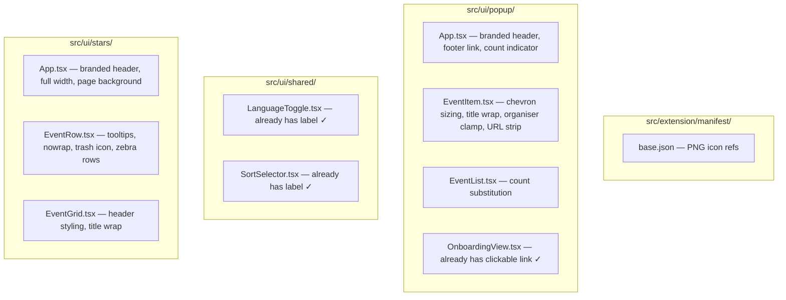

# Design Document: UI Polish Fixes

## Overview

This design addresses 17 visual and functional polish issues across the Almedalsstjärnan Chrome extension's Popup UI and Stars Page. The fixes are primarily UI-layer changes — updating manifest references, adjusting component rendering, fixing CSS classes, and adding missing affordances. The changes are independent and can be implemented incrementally without affecting core logic.

**Key design principles:**
- **Minimal core changes**: Most fixes are in UI components and the manifest. Only the description URL stripping and placeholder substitution touch logic.
- **Backward compatibility**: No storage schema changes. No new message commands.
- **i18n compliance**: All new user-facing strings use existing or new `_locales` message keys via `adapter.getMessage()`.
- **Accessibility**: All interactive elements maintain WCAG 2.1 AA compliance with proper ARIA attributes, focus indicators, and minimum touch targets.

## Architecture

The fixes integrate into the existing architecture without introducing new modules. Changes are localized to:



### Changes Summary

| File | Changes |
|------|---------|
| `src/extension/manifest/base.json` | Change `.svg` → `.png` in `action.default_icon` and `icons` |
| `src/ui/popup/App.tsx` | Already has branded header ✓, already has programme link ✓, fix count indicator substitution |
| `src/ui/popup/components/EventItem.tsx` | Increase chevron to 32×32 clickable / 20×20 SVG, use ▼/▲ chevrons, strip sourceUrl from description |
| `src/ui/popup/components/EventList.tsx` | Fix `{count}` / `{total}` placeholder substitution in count indicator |
| `src/ui/stars/App.tsx` | Add branded header, remove `max-w-7xl` constraint, add `bg-brand-surface` background |
| `src/ui/stars/components/EventRow.tsx` | Add `title` tooltips on all text cells, `whitespace-nowrap` on date, replace text button with trash SVG icon, zebra row classes |
| `src/ui/stars/components/EventGrid.tsx` | Remove `truncate` from title column, update header styling to brand colors |

## Components and Interfaces

### Manifest Icon Fix (Requirement 1)

The `base.json` manifest currently references `.svg` files. Chrome's `action.default_icon` and top-level `icons` fields require raster formats (PNG) for reliable toolbar rendering. The fix is a simple string replacement in the JSON.

**Before:**
```json
"default_icon": { "16": "icons/icon-16.svg", ... }
```

**After:**
```json
"default_icon": { "16": "icons/icon-16.png", ... }
```

### Event Count Indicator Substitution (Requirement 5)

The `eventCountIndicator` message uses `{count}` and `{total}` placeholders. The current `getLocalizedMessage` function in `src/core/locale-messages.ts` substitutes `$1`, `$2` style placeholders. The UI must call `getMessage` with the correct substitution format or perform manual replacement.

**Approach:** The EventList component will replace `{count}` and `{total}` tokens in the message string with actual values using a simple string replace:

```typescript
const countText = adapter.getMessage('eventCountIndicator')
  .replace('{count}', String(displayedCount))
  .replace('{total}', String(totalCount));
```

### Expand/Collapse Chevron Sizing (Requirement 8)

Current chevron: `w-6 h-6` button with `16×16` SVG. Required: `32×32` clickable area with `20×20` SVG.

**Change:** Update button classes to `w-8 h-8` (32px) and SVG to `width="20" height="20"`. Switch from right-pointing chevron with rotation to explicit downward (▼) / upward (▲) chevron paths for clarity.

### Description URL Stripping (Requirement 11)

When an event has a `sourceUrl` and the `description` field contains that same URL, the URL should be stripped from the rendered description to avoid redundancy (since the title is already a clickable link).

**Implementation:** A pure utility function:

```typescript
function stripSourceUrl(description: string, sourceUrl: string | null): string {
  if (!sourceUrl || !description) return description;
  return description.replace(sourceUrl, '').trim();
}
```

### Stars Page Full Width (Requirement 12)

Remove the `max-w-7xl` constraint from the Stars Page header and main containers. Keep horizontal padding (`px-4 sm:px-6 lg:px-8`) for readability.

### Stars Page Trash Icon (Requirement 15)

Replace the text-based unstar button in `EventRow` with a trash/bin SVG icon. The button retains `aria-label` for accessibility and has a `32×32` minimum clickable area.

### Stars Page Branded Header (Requirements 7, 17)

Add a branded header to the Stars Page matching the Popup UI header:
- Dark navy background (`bg-brand-secondary`)
- White bold title text from `extensionName` i18n key
- Amber star icon (`text-brand-accent`)
- 3px amber bottom border (`border-b-[3px] border-brand-primary`)

### Stars Page Visual Design (Requirement 16)

- Page background: `bg-brand-surface` (#fffbeb)
- Table rows: `odd:bg-white even:bg-brand-surface`
- Row hover: `hover:bg-amber-100`
- Header row: `border-b-2 border-brand-secondary` with `text-brand-secondary font-semibold`

## Data Models

No data model changes. All fixes are UI-layer and manifest-level. The existing `StarredEvent` type and storage schema remain unchanged.

## Correctness Properties

*A property is a characteristic or behavior that should hold true across all valid executions of a system — essentially, a formal statement about what the system should do. Properties serve as the bridge between human-readable specifications and machine-verifiable correctness guarantees.*

### Property 1: Placeholder substitution produces no raw tokens

*For any* pair of non-negative integers (count, total) where count ≤ total, substituting them into the `eventCountIndicator` message template SHALL produce a string that contains no raw `{count}` or `{total}` tokens and contains both numeric values as substrings.

**Validates: Requirements 5.1, 5.3**

### Property 2: Grid cell tooltips match full content

*For any* StarredEvent rendered in the Stars Page EventRow, the `title` attribute on the title cell SHALL equal `event.title`, the `title` attribute on the organiser cell SHALL equal `event.organiser ?? ''`, the `title` attribute on the location cell SHALL equal `event.location ?? ''`, and the `title` attribute on the topic cell SHALL equal `event.topic ?? ''`.

**Validates: Requirements 9.2, 10.2, 13.1, 13.2, 13.4**

### Property 3: Description URL stripping removes sourceUrl

*For any* event where `sourceUrl` is non-null and `description` contains the `sourceUrl` string, the stripped description SHALL NOT contain the `sourceUrl` as a substring.

**Validates: Requirements 11.1, 11.2**

## Error Handling

These polish fixes do not introduce new error paths. Existing error handling patterns remain:
- If `adapter.getMessage()` returns an empty string for a missing key, the UI renders empty text gracefully.
- If icon PNG files are missing, Chrome falls back to a default extension icon (no crash).
- The URL stripping function handles `null` description and `null` sourceUrl by returning the input unchanged.

## Testing Strategy

### Property-Based Tests (fast-check, minimum 100 iterations)

| Property | Test File | What It Validates |
|----------|-----------|-------------------|
| Property 1 | `tests/property/count-indicator-substitution.property.test.ts` | Placeholder substitution never leaves raw tokens |
| Property 2 | `tests/property/grid-truncation.property.test.ts` (extend existing) | All grid cells have correct title tooltips |
| Property 3 | `tests/property/description-url-strip.property.test.ts` | URL stripping removes sourceUrl from description |

### Unit Tests (Vitest)

| Area | Test File | Coverage |
|------|-----------|----------|
| Manifest | `tests/unit/extension/manifest.test.ts` | PNG references in both icon fields |
| EventItem chevron | `tests/unit/ui/popup/EventItem.test.tsx` | 32×32 button, 20×20 SVG, correct chevron direction |
| EventItem URL strip | `tests/unit/ui/popup/EventItem.test.tsx` | Description excludes sourceUrl when present |
| EventRow trash icon | `tests/unit/ui/stars/EventRow.test.tsx` | SVG icon rendered, aria-label present, 32×32 area |
| EventRow tooltips | `tests/unit/ui/stars/EventRow.test.tsx` | title attributes on all text cells |
| Stars App header | `tests/unit/ui/stars/App.test.tsx` | Branded header with correct classes and text |
| Stars App layout | `tests/unit/ui/stars/App.test.tsx` | No max-w-7xl, full width container |
| Count indicator | `tests/unit/ui/popup/EventList.test.tsx` | Correct substitution with various count/total values |

### What Is NOT Property-Tested

- CSS class presence (example-based unit tests are sufficient)
- Manifest JSON structure (smoke test)
- Visual rendering and layout (snapshot or example-based tests)
- Branded header rendering (example-based)
- Accessibility attributes (example-based)

These are UI rendering concerns where behavior does not vary meaningfully with input, making PBT inappropriate. Example-based unit tests provide adequate coverage.
