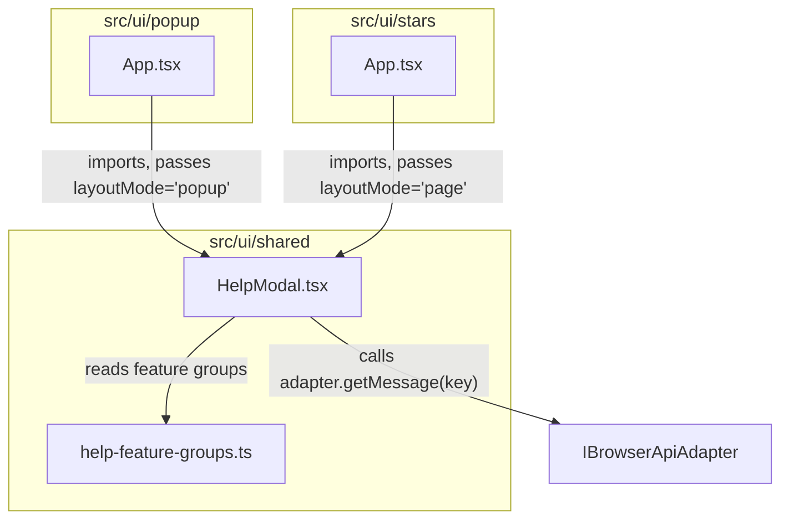

# Design Document: User Help Onboarding

## Overview

This feature replaces the existing minimal 4-step `OnboardingView` modal with a comprehensive, single-view quick-reference `HelpModal` that showcases all extension capabilities organised into 9 feature groups. The modal is shared between the popup (360×600px, single-column) and the stars page (responsive, two-column grid at ≥768px).

The core idea is a **data-driven modal**: a single `HelpModal` React component renders an ordered array of feature group descriptors. Each descriptor references i18n message keys for heading and description, plus an inline SVG icon factory. This keeps the component small and the content easily extensible.

### Design Decisions

| Decision | Rationale |
|----------|-----------|
| Single shared component in `src/ui/shared/HelpModal.tsx` | Avoids duplication; both popup and stars page import the same component. |
| Feature groups as a static data array (not fetched) | Content is static, compile-time data — no runtime cost, no network. |
| Inline SVG via React component functions | Avoids external image requests; decorative icons marked `aria-hidden="true"`. |
| Tailwind-only styling with responsive breakpoints | Matches project convention; `md:grid-cols-2` for stars page context. |
| `layoutMode` prop (`'popup' | 'page'`) | Lets the parent choose column layout without the modal needing viewport detection. |
| Reuse existing `onboardingDismissed` storage key and messages | No new storage schema or background message commands needed. |
| Focus trapping logic extracted from existing `OnboardingView` | Pattern already proven; refactor into shared utility or inline in new component. |

## Architecture



The `HelpModal` receives:
- `adapter` — for i18n string retrieval
- `onDismiss` — callback to close
- `triggerRef` — ref to the trigger element for focus return
- `layoutMode` — `'popup'` or `'page'` to control column layout

The existing `OnboardingView` will be replaced by rendering `HelpModal` in its place. The popup `App.tsx` continues to manage onboarding-dismissed state and the "How it works" trigger; the stars page `App.tsx` adds a help trigger button in its header.

## Components and Interfaces

### HelpModal Component

```typescript
// src/ui/shared/HelpModal.tsx

export interface HelpModalProps {
  readonly adapter: IBrowserApiAdapter;
  readonly onDismiss: () => void;
  readonly triggerRef?: React.RefObject<HTMLElement | null>;
  readonly layoutMode: 'popup' | 'page';
}

export function HelpModal(props: HelpModalProps): React.JSX.Element;
```

**Responsibilities:**
- Renders a full-screen backdrop with centered modal content
- Iterates over `HELP_FEATURE_GROUPS` array
- Resolves heading/description text via `adapter.getMessage()`
- Applies single-column for `layoutMode='popup'`, two-column grid (`md:grid-cols-2`) for `layoutMode='page'`
- Traps focus (Tab/Shift+Tab cycle, Escape to close)
- Moves initial focus to dismiss button
- Returns focus to `triggerRef` on close
- Closes on backdrop click
- Sets `role="dialog"`, `aria-modal="true"`, `aria-labelledby` referencing the title

### Feature Groups Data

```typescript
// src/ui/shared/help-feature-groups.ts

export interface HelpFeatureGroup {
  /** i18n message key for the group heading */
  readonly headingKey: string;
  /** i18n message key for the group description */
  readonly descriptionKey: string;
  /** React component that renders the inline SVG icon (decorative) */
  readonly Icon: () => React.JSX.Element;
}

export const HELP_FEATURE_GROUPS: readonly HelpFeatureGroup[];
```

The 9 groups in fixed display order:
1. **Star Events** — starring events on the programme page
2. **Popup View** — viewing starred events in the popup
3. **Stars Page** — dedicated full list view
4. **Sorting** — sort options
5. **Conflict Detection** — time overlap warnings
6. **Search & Filter** — search/filter on stars page
7. **Bulk Actions** — batch select, unstar, export
8. **ICS Export** — calendar export and what it means
9. **Language Toggle** — Swedish/English toggle

### Icon Components

Each icon is a small functional component rendering an inline SVG with:
- `aria-hidden="true"` (decorative)
- Fixed `24×24` viewBox, rendered at `w-6 h-6` via Tailwind
- `currentColor` fill for theme flexibility
- Minimum 3:1 contrast against modal background (white → icons use `text-brand-secondary` or `text-gray-700`)

### Integration Points

**Popup `App.tsx`:**
- Replace `<OnboardingView>` usage with `<HelpModal layoutMode="popup">`
- Keep existing `showOnboarding` state, `handleDismissOnboarding`, `handleShowOnboarding` logic
- Keep existing `helpLinkRef` for focus return

**Stars `App.tsx`:**
- Add `showHelp` state, `helpTriggerRef`
- Add help trigger button in header (icon + localized text)
- Render `<HelpModal layoutMode="page">` conditionally
- No onboarding-dismissed logic needed on stars page (help is opt-in only)

## Data Models

### New i18n Message Keys

The following keys are added to both `_locales/sv/messages.json` and `_locales/en/messages.json`:

| Key | Purpose |
|-----|---------|
| `helpModalTitle` | Modal title heading |
| `helpModalDismiss` | Dismiss button label |
| `helpGroupStarEventsHeading` | Feature group 1 heading |
| `helpGroupStarEventsDesc` | Feature group 1 description |
| `helpGroupPopupViewHeading` | Feature group 2 heading |
| `helpGroupPopupViewDesc` | Feature group 2 description |
| `helpGroupStarsPageHeading` | Feature group 3 heading |
| `helpGroupStarsPageDesc` | Feature group 3 description |
| `helpGroupSortingHeading` | Feature group 4 heading |
| `helpGroupSortingDesc` | Feature group 4 description |
| `helpGroupConflictHeading` | Feature group 5 heading |
| `helpGroupConflictDesc` | Feature group 5 description |
| `helpGroupSearchFilterHeading` | Feature group 6 heading |
| `helpGroupSearchFilterDesc` | Feature group 6 description |
| `helpGroupBulkActionsHeading` | Feature group 7 heading |
| `helpGroupBulkActionsDesc` | Feature group 7 description |
| `helpGroupIcsExportHeading` | Feature group 8 heading |
| `helpGroupIcsExportDesc` | Feature group 8 description |
| `helpGroupLanguageHeading` | Feature group 9 heading |
| `helpGroupLanguageDesc` | Feature group 9 description |

Total: 20 new message keys (1 title + 1 dismiss + 9×2 group keys).

### No Storage Schema Changes

The feature reuses the existing `onboardingDismissed` boolean in `StorageSchema` and the existing `GET_ONBOARDING_STATE` / `SET_ONBOARDING_STATE` message commands. No new storage fields or background message handlers are required.

### No New Background Message Commands

The `HelpModal` is purely a UI component. It reads i18n strings synchronously via `adapter.getMessage()` and delegates dismissal state management to the parent component (popup `App.tsx`).

## Correctness Properties

*A property is a characteristic or behavior that should hold true across all valid executions of a system — essentially, a formal statement about what the system should do. Properties serve as the bridge between human-readable specifications and machine-verifiable correctness guarantees.*

### Property 1: i18n Completeness

*For any* Help_Modal message key (modal title, dismiss label, and all 9 feature group heading/description keys) and *for any* supported locale (`sv`, `en`), the locale message catalog SHALL contain an entry with a non-empty `message` field and a non-empty `description` field.

**Validates: Requirements 7.1, 7.2, 7.3**

### Property 2: Heading Length Constraint

*For any* feature group in `HELP_FEATURE_GROUPS` and *for any* supported locale (`sv`, `en`), the resolved heading string SHALL have a length of at most 40 characters.

**Validates: Requirements 1.3**

### Property 3: Focus Trapping Invariant

*For any* sequence of N Tab key presses (where N ranges from 1 to 100) while the Help_Modal is open, the currently focused element SHALL remain within the modal container's DOM subtree.

**Validates: Requirements 5.1**

### Property 4: Decorative Icon Accessibility

*For any* SVG icon element rendered within the Help_Modal's feature group list, the element SHALL have the attribute `aria-hidden="true"`.

**Validates: Requirements 8.2**

## Error Handling

| Scenario | Behaviour |
|----------|-----------|
| `GET_ONBOARDING_STATE` returns error response | Popup defaults to showing the Help_Modal (fail-open for discoverability). |
| `SET_ONBOARDING_STATE` returns error after dismiss | Modal hides for the current session; may reappear next popup open. No error shown to user. |
| `adapter.getMessage(key)` returns empty string | The `getLocalizedMessage` utility already falls back: if the active locale has no entry, it returns `''`, and the `localizedAdapter` pattern in both App components falls through to `adapter.getMessage(key)` which uses browser i18n. If both fail, text is empty — this is prevented by Property 1 ensuring all keys exist. |
| Feature group data array is malformed | Compile-time TypeScript validation prevents this — `HELP_FEATURE_GROUPS` is typed as `readonly HelpFeatureGroup[]`. |

No user-facing error states are needed because the modal content is entirely static/local. No network requests are involved.

## Testing Strategy

### Unit Tests (Vitest + Testing Library)

- **HelpModal rendering**: verify all 9 groups render with icon, heading, and description
- **HelpModal accessibility attributes**: `role="dialog"`, `aria-modal="true"`, `aria-labelledby`
- **Focus management**: initial focus on dismiss button, focus return on close
- **Keyboard interaction**: Escape closes, Enter/Space on dismiss button closes
- **Backdrop click**: clicking outside modal content triggers onDismiss
- **Layout modes**: `layoutMode='popup'` uses single-column, `layoutMode='page'` uses two-column grid classes
- **Popup App integration**: onboarding shows on first run, hides after dismiss, help link re-opens without persisting state
- **Stars App integration**: help trigger opens modal, dismiss closes it
- **Error cases**: GET_ONBOARDING_STATE failure defaults to showing modal, SET_ONBOARDING_STATE failure still hides modal

### Property-Based Tests (fast-check)

Property-based testing applies to this feature for validating i18n completeness, heading constraints, and accessibility invariants across all feature groups and locales.

- **Library**: fast-check (already in devDependencies)
- **Minimum iterations**: 100 per property test
- **Tag format**: `// Feature: user-help-onboarding, Property {N}: {title}`

Properties to implement:
1. **i18n Completeness** — generate combinations of all 20 Help_Modal keys × 2 locales, assert non-empty message and description in catalog
2. **Heading Length** — for each feature group × each locale, assert heading ≤ 40 chars
3. **Focus Trapping** — for random number of Tab presses (1–100), assert activeElement stays in modal
4. **Decorative Icons** — for each rendered SVG in the modal, assert aria-hidden="true"

### What NOT to Property-Test

- Visual layout (single-column vs two-column) — verified by example-based class presence checks
- Backdrop opacity / styling — visual design, not a computable property
- WCAG contrast ratios — require manual audit with tooling
- Focus indicator styling — CSS/visual concern

