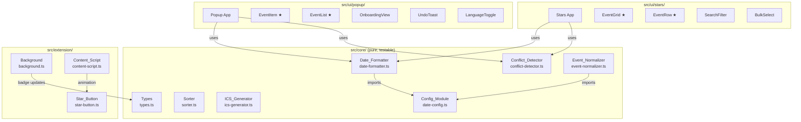

# Design Document: UX Enhancements

## Overview

This design covers eight areas of UX improvement to the Almedalsstjärnan browser extension, transforming it from a functional prototype into a polished, user-friendly tool. The enhancements are designed as independent, modular units that can be implemented and shipped incrementally without breaking existing functionality.

**Key design principles:**
- **Modularity**: Each requirement group is independently implementable.
- **Backward compatibility**: Existing storage schema (`starredEvents`, `sortOrder`) is preserved. New keys are additive.
- **Pure core logic**: Date formatting, conflict detection, and configuration are pure functions/constants in `src/core/`, testable without browser APIs.
- **Human approval gates**: Visual design (Req 3) and conflict visualization (Req 8) require presenting options before implementation.
- **i18n throughout**: All new user-facing strings go through `_locales/{locale}/messages.json` and `adapter.getMessage()`.

## Architecture

The enhancements integrate into the existing layered architecture:



**★ = modified existing component**

### New Modules

| Module | Location | Type | Purpose |
|--------|----------|------|---------|
| `date-config.ts` | `src/core/` | Constants | Year-specific date mappings, extracted from event-normalizer |
| `date-formatter.ts` | `src/core/` | Pure function | ISO 8601 → human-readable locale-aware formatting |
| `conflict-detector.ts` | `src/core/` | Pure function | Computes overlapping event pairs from an events array |
| `OnboardingView` | `src/ui/popup/components/` | React component | First-run guidance, dismissible |
| `UndoToast` | `src/ui/shared/` | React component | Timer-based undo notification |
| `SearchFilter` | `src/ui/stars/components/` | React component | Text filter input |
| `BulkActions` | `src/ui/stars/components/` | React component | Checkbox selection + batch controls |
| `LanguageToggle` | `src/ui/shared/` | React component | Manual language override |

### Modified Modules

| Module | Changes |
|--------|---------|
| `types.ts` | Add `StorageSchema` keys: `languagePreference`, `onboardingDismissed` |
| `event-normalizer.ts` | Import `DAY_TO_DATE` from `date-config.ts` instead of inline |
| `background.ts` | Add badge update logic, undo-delay pattern, new message commands |
| `EventItem.tsx` | Add expand/collapse, star toggle, source link, date formatting |
| `EventList.tsx` | Add count indicator, pagination/load-more |
| `EventRow.tsx` | Add date formatting, conflict indicator, checkbox |
| `EventGrid.tsx` | Add zebra striping, date grouping, section headers |
| `star-button.ts` | Add scale/color animation on star transition |
| `tailwind.config.ts` | Extend with custom color palette (after approval) |

## Components and Interfaces

### 1. Config Module (`src/core/date-config.ts`)

```typescript
/**
 * Year-specific Almedalsveckan configuration.
 * Update annually when dates are announced.
 */

/** Stockholm summer timezone offset */
export const STOCKHOLM_SUMMER_OFFSET = '+02:00' as const;

/** Swedish day names used in DOM time text */
export const SWEDISH_DAYS = [
  'Måndag', 'Tisdag', 'Onsdag', 'Torsdag', 'Fredag', 'Lördag', 'Söndag',
] as const;

/**
 * Almedalsveckan 2026 date mapping.
 * The week starts on Monday June 22 and runs through Sunday June 28.
 *
 * Update cadence: annually, when Almedalsveckan dates are announced
 * (typically 6–12 months before the event).
 */
export const DAY_TO_DATE: Readonly<Record<string, string>> = {
  Måndag: '2026-06-22',
  Tisdag: '2026-06-23',
  Onsdag: '2026-06-24',
  Torsdag: '2026-06-25',
  Fredag: '2026-06-26',
  Lördag: '2026-06-27',
  Söndag: '2026-06-28',
} as const;
```

The `event-normalizer.ts` will import these constants instead of defining them inline. This is a pure extraction — no behavioral change.

### 2. Date Formatter (`src/core/date-formatter.ts`)

A pure utility function that converts ISO 8601 date-time strings into locale-appropriate human-readable format.

```typescript
export type DateFormatterLocale = 'sv' | 'en';

/**
 * Formats an event's date-time range for display.
 *
 * @param startDateTime - ISO 8601 string (e.g., "2026-06-22T07:30:00+02:00")
 * @param endDateTime - ISO 8601 string or null
 * @param locale - 'sv' or 'en'
 * @returns Formatted string, e.g., "Mån 22 juni 07:30–08:30" (sv) or "Mon 22 Jun 07:30–08:30" (en)
 */
export function formatEventDateTime(
  startDateTime: string,
  endDateTime: string | null,
  locale: DateFormatterLocale,
): string;
```

**Formatting rules:**
- Swedish: `"Mån 22 juni 07:30–08:30"` — abbreviated day, day number, full month name, time range
- English: `"Mon 22 Jun 07:30–08:30"` — abbreviated day, day number, abbreviated month name, time range
- When `endDateTime` is null or on a different day: show only start time
- When `endDateTime` is on the same day: show time range with en-dash `–`
- Time format: 24-hour `HH:MM` (no seconds)

**Implementation approach:** Parse the ISO string manually (split on `T`, `-`, `:`) rather than using `Date` constructor, to avoid timezone conversion issues. The offset is already embedded in the ISO string.

**Lookup tables** for day/month names by locale, keyed by numeric index. These are internal to the module (not in config) since they don't change annually.

### 3. Conflict Detector (`src/core/conflict-detector.ts`)

A pure computation on an events array that returns pairs of conflicting event IDs.

```typescript
export interface ConflictPair {
  readonly eventIdA: string;
  readonly eventIdB: string;
}

/**
 * Finds all pairs of events with overlapping time ranges.
 *
 * Overlap rule: event A conflicts with event B when
 *   A.start < B.end AND A.end > B.start
 *
 * Events with no endDateTime are treated as zero-duration (point-in-time):
 *   they conflict only if another event's range contains that exact start time.
 *
 * @param events - Array of events with startDateTime and optional endDateTime
 * @returns Array of ConflictPair, each pair listed once (A < B by id sort)
 */
export function detectConflicts(
  events: ReadonlyArray<{
    readonly id: string;
    readonly startDateTime: string;
    readonly endDateTime: string | null;
  }>,
): ConflictPair[];

/**
 * Builds a Set of event IDs that participate in at least one conflict.
 * Convenience wrapper around detectConflicts.
 */
export function getConflictingEventIds(
  events: ReadonlyArray<{
    readonly id: string;
    readonly startDateTime: string;
    readonly endDateTime: string | null;
  }>,
): Set<string>;
```

**Algorithm:** Sort events by `startDateTime`, then use a sweep-line approach. For each event, compare against subsequent events until the next event's start is past the current event's end. This gives O(n log n + k) where k is the number of conflicts, rather than O(n²).

**Zero-duration events:** When `endDateTime` is null, treat `end = start` for comparison purposes. A zero-duration event at time T conflicts with any event whose range strictly contains T (i.e., `other.start < T < other.end`), but two zero-duration events at the same time also conflict (`A.start === B.start`).

### 4. Undo Toast Pattern

The undo mechanism uses a **delayed deletion** approach:

1. User clicks unstar → UI immediately removes the event from the displayed list (optimistic update)
2. A toast appears with "Undo" action and a 5-second countdown
3. The event data is held in a pending-deletion queue (React state, not storage)
4. If user clicks "Undo" within 5 seconds → event is re-added to storage via `STAR_EVENT` message, toast dismissed
5. If timer expires → `UNSTAR_EVENT` message is sent to background, event permanently removed from storage

This means the current immediate `UNSTAR_EVENT` dispatch is deferred. The `UndoToast` component manages its own timer via `useEffect` cleanup.

```typescript
// src/ui/shared/UndoToast.tsx
export interface UndoToastProps {
  readonly eventTitle: string;
  readonly onUndo: () => void;
  readonly onExpire: () => void;
  readonly durationMs?: number; // default 5000
  readonly adapter: IBrowserApiAdapter;
}
```

**Multiple undos:** If the user unstars multiple events in quick succession, each gets its own toast. Toasts stack vertically. Each has an independent timer.

### 5. Badge Updates

Badge updates happen in the background service worker. When `starredEvents` changes in storage, the service worker updates the badge:

```typescript
// In background.ts — register storage.onChanged listener
chrome.storage.onChanged.addListener((changes, areaName) => {
  if (areaName === 'local' && 'starredEvents' in changes) {
    const newEvents = changes.starredEvents?.newValue ?? {};
    const count = Object.keys(newEvents).length;
    chrome.action.setBadgeText({ text: count > 0 ? String(count) : '' });
    chrome.action.setBadgeBackgroundColor({ color: '#f59e0b' });
  }
});
```

This runs at the top level of the service worker module, alongside the existing `onMessage` listener. No new message commands needed — the badge is a side effect of storage changes.

### 6. Popup Enhancements

**Export button:** Reuse the same `generateICS` + blob download pattern from the Stars page hook. Add an export button in the popup footer next to "Open full list".

**Star toggle per event:** Each `EventItem` gets a small filled-star button. Clicking it triggers the undo flow (delayed `UNSTAR_EVENT`).

**Source link:** When `event.sourceUrl` is non-null, render the title as an `<a>` with `target="_blank" rel="noopener noreferrer"`. Clicking opens the source page.

**Expand/collapse:** Each `EventItem` gets a chevron toggle. Collapsed state shows title + organiser + formatted date. Expanded state adds description, topic, and full time range. State is local (React `useState` per item), not persisted.

**Count indicator:** Header shows `"{displayed} av {total}"` (sv) or `"{displayed} of {total}"` (en). New i18n key: `eventCountIndicator` with `$1` and `$2` placeholders.

**Pagination:** When total > 20, show a "Load more" button below the list. Each click loads the next 20. Alternatively, implement simple page-based pagination with prev/next controls. The load-more pattern is simpler and fits the popup's vertical scroll layout.

### 7. Stars Page Enhancements

**Search filter:** A text input above the grid. Filters `events` array in the hook by checking if `title`, `organiser`, or `topic` contains the filter text (case-insensitive, using `toLowerCase().includes()`). Debounce not needed for local filtering of ≤200 events.

**Date grouping:** Group the sorted events by date (extract `YYYY-MM-DD` from `startDateTime`). Render a `Section_Header` row spanning all columns before each group. Within each group, events are sorted by start time ascending (which is already the case when sort order is chronological).

**Bulk selection:** Add a checkbox column. A "select all" checkbox in the header. When ≥1 event is selected, show a floating action bar with "Unstar selected" and "Export selected" buttons. Selection state is local React state (`Set<EventId>`).

**Column rename:** Replace `"Actions"` header with empty string or a visually minimal label. Update i18n keys.

### 8. Onboarding and Language

**Onboarding:** On popup mount, check `storage.local` for `onboardingDismissed`. If not set, show the `OnboardingView` component above the event list. Dismissing sets `onboardingDismissed: true` in storage. A "How it works" link in the popup footer re-opens it (sets local state, doesn't clear storage).

**Language toggle:** A `<select>` with options "Svenska" and "English" plus "Auto (browser)". Stored as `languagePreference` in `storage.local`. When set, the popup/stars page use it to select which locale's strings to display. This requires a custom `getMessage` wrapper that reads from the appropriate `_locales/{locale}/messages.json` at runtime, since `chrome.i18n.getMessage` always uses the browser locale.

**Implementation note:** Since `chrome.i18n.getMessage` can't be overridden, the language toggle will need to bundle both locale files and select strings at runtime. The adapter interface gains a `setLocaleOverride(locale: 'sv' | 'en' | null)` method, and `getMessage` checks the override first.

### 9. Star Button Animation

Add a CSS `@keyframes` animation to the star button's scoped CSS:

```css
@keyframes star-pop {
  0% { transform: scale(1); }
  50% { transform: scale(1.3); }
  100% { transform: scale(1); }
}
.star-btn[aria-pressed="true"] svg {
  animation: star-pop 0.3s ease-out;
}
```

The animation triggers when `aria-pressed` changes to `"true"`. This is purely CSS — no JS animation logic needed.

### 10. Error Resilience for Star Button

When the `onStar`/`onUnstar` callback fails (background service worker unavailable):
- The star button reverts to its previous visual state
- A brief red flash animation plays (CSS class added/removed via JS)
- The error is logged to console

```typescript
// In content-script.ts processEventCard:
onStar: async (id: string) => {
  try {
    const response = await adapter.sendMessage({ command: 'STAR_EVENT', event });
    if (response.success) {
      updateAllButtonsForEvent(id, true);
    } else {
      // Revert and flash error
      updateAllButtonsForEvent(id, false);
      flashError(host);
    }
  } catch {
    updateAllButtonsForEvent(id, false);
    flashError(host);
  }
},
```

## Data Models

### Extended Storage Schema

```typescript
export interface StorageSchema {
  /** Existing: Object keyed by EventId, values are StarredEvent objects */
  readonly starredEvents: Record<EventId, StarredEvent>;
  /** Existing: Current sort order preference */
  readonly sortOrder: SortOrder;
  /** New: Manual language override. null = follow browser default */
  readonly languagePreference: 'sv' | 'en' | null;
  /** New: Whether the onboarding view has been dismissed */
  readonly onboardingDismissed: boolean;
}
```

**Backward compatibility:** The two new keys are optional in storage. When absent, `languagePreference` defaults to `null` (browser default) and `onboardingDismissed` defaults to `false` (show onboarding). Existing installations with only `starredEvents` and `sortOrder` will work without migration.

### New Message Commands

The existing 6 message commands remain unchanged. New commands needed:

| Command | Payload | Response | Purpose |
|---------|---------|----------|---------|
| `GET_LANGUAGE_PREFERENCE` | `{}` | `'sv' \| 'en' \| null` | Read language override |
| `SET_LANGUAGE_PREFERENCE` | `{ locale: 'sv' \| 'en' \| null }` | `void` | Persist language override |
| `GET_ONBOARDING_STATE` | `{}` | `boolean` | Check if onboarding dismissed |
| `SET_ONBOARDING_STATE` | `{ dismissed: boolean }` | `void` | Persist onboarding dismissal |

These follow the same pattern as existing commands: dispatched in `handleMessage`, routed by `command` string, using `adapter.storageLocalGet`/`Set`.

### Conflict Detection Data Flow

```
StarredEvent[] → detectConflicts() → ConflictPair[] → Set<EventId> → UI rendering
```

The conflict detector operates on the already-fetched events array in the UI hooks. No new storage or message commands needed. Conflicts are recomputed whenever the events array changes (star, unstar, storage change).


## Correctness Properties

*A property is a characteristic or behavior that should hold true across all valid executions of a system — essentially, a formal statement about what the system should do. Properties serve as the bridge between human-readable specifications and machine-verifiable correctness guarantees.*

### Property 1: Filter returns only matching events

*For any* array of starred events and *for any* non-empty filter string, applying the text filter SHALL return only events where the title, organiser, or topic contains the filter string (case-insensitive). Additionally, no event that matches the filter SHALL be excluded from the results.

**Validates: Requirements 2.1, 2.2**

### Property 2: Date grouping and within-group ordering

*For any* array of starred events sorted chronologically, grouping by date SHALL produce groups where: (a) every event in a group has the same date component in its `startDateTime`, (b) within each group events are ordered by `startDateTime` ascending, and (c) the groups themselves are ordered by date ascending.

**Validates: Requirements 2.3, 2.4**

### Property 3: Date formatting round-trip consistency

*For any* valid ISO 8601 date-time string with timezone offset (e.g., `YYYY-MM-DDTHH:MM:SS+02:00`) and *for any* supported locale (`sv` or `en`), formatting the string and then extracting the numeric day, hour, and minute components from the formatted output SHALL produce values equal to the corresponding components in the original ISO string.

**Validates: Requirements 4.1, 4.8**

### Property 4: Range formatting correctness

*For any* valid ISO 8601 start date-time string and *for any* end date-time string on the same calendar day, the formatted output SHALL contain an en-dash (`–`) separating two time values. Conversely, *for any* start date-time with a null end date-time, the formatted output SHALL NOT contain an en-dash.

**Validates: Requirements 4.4, 4.5**

### Property 5: Undo restores original event data

*For any* starred event, if the event is unstarred and then the undo action is triggered before the toast expires, the restored event SHALL be deeply equal to the original starred event (same id, title, organiser, startDateTime, endDateTime, location, description, topic, sourceUrl, icsDataUri, starredAt).

**Validates: Requirements 7.2**

### Property 6: Badge count matches starred event count

*For any* record of starred events (including the empty record), the badge text SHALL equal the string representation of the number of entries when the count is greater than zero, and SHALL be the empty string when the count is zero.

**Validates: Requirements 7.4, 7.6**

### Property 7: Conflict detection correctness

*For any* array of events with `startDateTime` and optional `endDateTime`, the `detectConflicts` function SHALL return a pair `(A, B)` if and only if `A.start < B.effectiveEnd AND A.effectiveEnd > B.start` (where `effectiveEnd = endDateTime ?? startDateTime`). Furthermore, removing any event from the array and re-running detection SHALL produce a result that contains no pairs involving the removed event's ID.

**Validates: Requirements 8.1, 8.3, 8.4, 8.6**

### Property 8: Star button reverts on message failure

*For any* star button in a given visual state (starred or unstarred), if the corresponding message to the background service worker fails (rejects or returns `success: false`), the button SHALL return to its original visual state (the `aria-pressed` attribute SHALL equal its value before the click).

**Validates: Requirements 7.8**

## Error Handling

### Storage Errors

- All `adapter.storageLocalGet`/`Set` calls are wrapped in try/catch in the background service worker.
- Storage errors return `MessageResponse` with `success: false` and a descriptive error string.
- UI components display the localized `errorStorageFailed` message on storage errors.

### Message Passing Errors

- `adapter.sendMessage` may reject if the service worker is unavailable (MV3 lifecycle).
- Content script star button: catches errors, reverts visual state, flashes error indicator.
- Popup/Stars page: catches errors, shows inline error message, does not corrupt local state.

### Undo Toast Edge Cases

- If the popup/stars page is closed during the undo window, the pending deletion is lost (event remains starred). This is the safe default — data is preserved.
- If multiple events are unstarred rapidly, each gets an independent toast and timer. No race conditions because each toast manages its own event reference.

### Date Formatter Errors

- `formatEventDateTime` receives already-validated ISO strings from storage (validated at normalization time).
- If an invalid string is somehow passed, the function returns the raw string unchanged as a fallback, rather than throwing.

### Conflict Detector Errors

- `detectConflicts` is a pure function on validated data. No external I/O, no error states.
- Events with identical `startDateTime` and null `endDateTime` (two zero-duration events at the same time) are treated as conflicting.

### Badge Update Errors

- `chrome.action.setBadgeText` may fail silently if the extension context is invalidated. This is acceptable — the badge will update on the next storage change.

## Testing Strategy

### Property-Based Tests (fast-check)

PBT is appropriate for this feature because several core modules are pure functions with clear input/output behavior and large input spaces:

- **Date Formatter**: Pure function, infinite input space (any valid ISO 8601 string × 2 locales)
- **Conflict Detector**: Pure function, combinatorial input space (any array of events)
- **Filter logic**: Pure function, string matching across multiple fields
- **Date grouping**: Pure function, partitioning events by date

**Library:** fast-check (already in devDependencies)
**Minimum iterations:** 100 per property (`numRuns: 100`)
**Tag format:** `// Feature: ux-enhancements, Property {N}: {title}`

Each of the 8 correctness properties maps to a single property-based test file in `tests/property/`:

| Property | Test File |
|----------|-----------|
| 1: Filter matching | `filter-matching.property.test.ts` |
| 2: Date grouping | `date-grouping.property.test.ts` |
| 3: Date format round-trip | `date-format-roundtrip.property.test.ts` |
| 4: Range formatting | `date-format-range.property.test.ts` |
| 5: Undo round-trip | `undo-roundtrip.property.test.ts` |
| 6: Badge count | `badge-count.property.test.ts` |
| 7: Conflict detection | `conflict-detection.property.test.ts` |
| 8: Star button revert | `star-button-revert.property.test.ts` |

### Unit Tests (Vitest)

Unit tests cover specific examples, edge cases, and integration points:

**`src/core/date-formatter.ts`:**
- Swedish format with known dates (Req 4.2)
- English format with known dates (Req 4.3)
- Null endDateTime produces no range (Req 4.5)
- Cross-day start/end (edge case)

**`src/core/date-config.ts`:**
- Exports DAY_TO_DATE with 7 entries (Req 5.1)
- All values are valid ISO date strings (Req 5.1)

**`src/core/conflict-detector.ts`:**
- No conflicts in non-overlapping events
- Two overlapping events detected
- Three-way overlap (A overlaps B, B overlaps C, A doesn't overlap C)
- Zero-duration events (null endDateTime)
- Empty array returns empty

**`src/ui/popup/` components:**
- EventItem renders star toggle (Req 1.2)
- EventItem renders source link when sourceUrl present (Req 1.4)
- EventItem expand/collapse toggle (Req 1.6, 1.7)
- EventList shows count indicator (Req 1.8)
- EventList pagination/load-more (Req 1.9)
- Export button triggers ICS download (Req 1.1)

**`src/ui/stars/` components:**
- SearchFilter filters events (Req 2.1)
- EventGrid date grouping with section headers (Req 2.3)
- BulkActions select/unstar/export (Req 2.5, 2.6)
- Column header rename (Req 2.7)

**`src/ui/shared/UndoToast.tsx`:**
- Toast appears on unstar (Req 7.1)
- Undo click restores event (Req 7.2)
- Timer expiry triggers permanent deletion (Req 7.3)

**`src/extension/background.ts`:**
- Badge update on storage change (Req 7.4, 7.5)
- Badge cleared on zero events (Req 7.6)
- New message commands (language, onboarding)

**`src/ui/popup/components/OnboardingView.tsx`:**
- Renders on first run (Req 6.1)
- Contains all required sections (Req 6.2)
- Dismissible (Req 6.3)
- Help link re-opens (Req 6.4)

**`src/ui/shared/LanguageToggle.tsx`:**
- Renders with correct options (Req 6.5)
- Persists selection (Req 6.6)
- Default follows browser (Req 6.7)

### E2E Tests (Playwright)

E2E tests for critical flows only:
- Star event → verify badge updates → open popup → verify count → export ICS
- Unstar from popup → verify undo toast → click undo → verify event restored
- Stars page search filter with multiple events
- Conflict indicators visible for overlapping events

### Human Review Checkpoints

Visual design items require human approval before implementation:
1. **Color palette and branding** (Req 3.1–3.3, 3.10, 3.11): Present 2–3 palette options with mockups
2. **Icon redesign** (Req 3.7, 3.8): Present 2–3 icon concepts at all four sizes
3. **Conflict visualization** (Req 8.7, 8.8): Present visualization approaches (colored grouping, timeline, connecting lines)

These checkpoints are embedded in the task list as explicit review gates.
